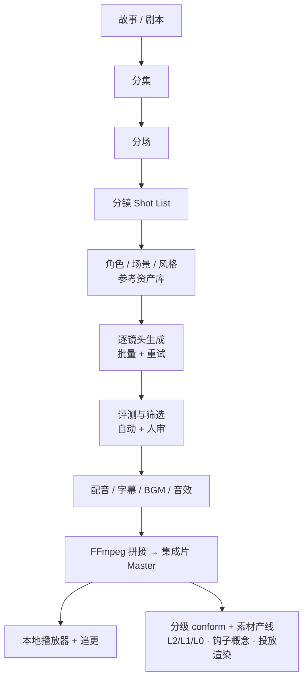

# 00 · 项目总览与范围定义

> Status: Draft v1 · 2026-08-10 · Owner: Jason

## 1. 一句话定义

`ai-drama-studio` 是一个**本地优先（local-first）的 AI 短剧生产系统**：输入一个故事，输出可播放的分集短剧成片。它同时是生产工具（Studio）和播放器（Player）。

第一阶段目标不是商业化，而是**把「文本 → 可播放视频」这条主干在本地完整跑通**，并且这条主干的每一环都可替换、可观测、可计价。

## 2. 为什么要自建，而不是用现成工具

现成的一站式 AI 视频工具（即梦、可灵网页版、Seko 等）解决的是「生成一个片段」。它们解决不了三件事，而这三件事恰恰是短剧工业化的全部难点：

1. **跨镜头的状态延续**：同一个角色在第 47 个镜头里必须还是同一张脸、同一身衣服。
2. **规模化的批处理与记账**：一部剧 800–2500 个镜头，需要队列、重试、成本归集，而不是人肉点「生成」。
3. **可替换的生成后端**：模型和价格每季度都在变，业务逻辑不能和某一家 API 绑死。

本项目的全部设计都围绕这三点展开。

## 2.5 市场定位：北美 R 级竖屏短剧

**本系统面向北美市场的 R 级（MPA R / TV-MA）竖屏短剧，不对齐中国国内模式。** 这个定位决定了架构上的四处根本差异：

| | 中国模式 | 本系统（北美 R 级） |
|---|---|---|
| **收入结构** | 平台分账兜底（红果/番茄），流量成本由平台承担 | **无分账**。收入 = 买量效率。美国 CAC $3–7/安装，回本周期 <60 天是生存线 |
| **成本结构** | 制作为主 | **营销约为制作的 9 倍**，头部平台高达 90% 预算投在获客。→ 系统的主产物是素材，正片是原材料 |
| **分发** | 抖音生态内闭环 | 免费平台引流（FB 25% / TikTok 19% / **Snapchat 16%** / IG 8% / YouTube 仅 2%）→ 自有 App/Web 转化 |
| **内容分级** | 备案 + AIGC 标识 | **三层分级**（投放安全 / 商店安全 / 完整 TV-MA），见 §4 约束 C7 |

**形态标准（按北美实际口径，非中国口径）**：80–100 集 × 60–90 秒，总时长 80–150 分钟（≈一部电影），前 7–10 集免费，付费墙落在悬念点而非集尾整数位。

**战略排序：先打曝光，再优化细节。** 这不是营销口号，是架构约束——它决定了系统必须在正片之外把素材产线做成一等公民，且素材的分级、标签、变体矩阵要在生成阶段就写入，而不是事后补。

## 3. 范围（Scope）

### 3.1 In Scope — 完整流水线

### 3.2 Out of Scope（第一阶段明确不做）

| 不做 | 原因 |
|---|---|
| 支付、订阅、权益系统 | 本阶段目标是生产链路，不是变现 |
| 多租户 / 用户体系 | 单人本地使用，`user_id` 字段预留但不实现登录 |
| CDN / 大规模分发 | 本地文件服务 + HTTP Range 足够 |
| 内容审核与合规闸门 | 架构预留 `safety_profile` 字段与 Eval 钩子，逻辑后置 |
| 移动端 App | Web 响应式即可 |

> 注意：Out of Scope 不等于「架构里不留位置」。数据模型和接口层会为这些能力预留扩展点，见 `02-data-model.md`。

## 4. 关键设计约束

| 约束 | 含义 |
|---|---|
| **C1 · 语言分工** | Web 与业务控制面用 TypeScript；模型推理、CV、媒体处理用 Python。两者只通过 HTTP 契约通信，不共享进程。 |
| **C2 · 生成后端可替换** | 任何生成能力都藏在 Provider 适配器之后。业务代码永远不 import 某个厂商 SDK。见 `04-provider-adapter.md`。 |
| **C3 · 开发机无 GPU** | Mac 只跑 Web + 控制面 + 轻量媒体处理；一切 GPU 工作在远程 worker 上。本地必须能在**没有任何 GPU**的情况下用 mock provider 跑通全流程。 |
| **C4 · 一切生成留痕** | 每一次生成尝试（含失败）都写入 Generation Ledger：参数、种子、耗时、成本、评测、是否采用。这是后续所有优化的数据基础。 |
| **C5 · 母版不可变** | Master 资产只增不改。任何「修改」都是产生新版本 + 记录 lineage。 |
| **C6 · 存储接口即 S3** | 本地用 MinIO 提供 S3 API，代码永远按 S3 写。将来换云存储零改动。 |
| **C7 · 三层分级镜头级分离** | 每个内容产物有三个分级层：**L0 投放安全**（广告素材/商店截图）、**L1 商店安全**（App 内正片，Apple 16+ 上限）、**L2 完整 TV-MA**（Web + 年龄门控）。分级必须在**镜头级**分离——剧情信息与尺度画面永不同镜，降级即删换镜头而非重剪场景。 |
| **C8 · 素材是一等产物** | 单部剧的交付物不是 80–100 集正片，而是 600–1200 个产物（正片 + 素材 + 商店资产 + 联盟包）。数据模型必须把 HookConcept / Render 建成实体，而非正片的附属。 |

## 5. 术语表（全项目统一）

| 术语 | 定义 |
|---|---|
| **Project** | 一部剧。顶层容器。 |
| **Episode** | 一集，60–90 秒（典型 75 秒），见 §2.5 形态标准。 |
| **Scene** | 一场戏，同一时间地点的连续叙事单元。 |
| **Shot** | 一个镜头，生成的最小单位。**上限 10 秒**（硬约束），常用 2–8 秒。 |
| **Shot Intent** | 镜头的结构化意图：景别、机位、动作、情绪、时长、参考资产。**不是 prompt**，是生成 prompt 的输入。 |
| **Asset** | 任何二进制产物：图、视频、音频、字幕、母版。带 hash 与 lineage。 |
| **Character / Location / StyleProfile** | 可复用的一致性资产，各自持有参考图集与描述。 |
| **Provider** | 一个生成后端的适配器实现（云 API 或自部署 worker）。 |
| **Generation Job** | 一次生成尝试。一个 Shot 可能对应多个 Job（重试/多方案）。 |
| **Take** | 一个 Job 产出的一条候选视频。一个 Shot 从多个 Take 中选一条 `selected`。 |
| **Eval** | 对 Take 的自动或人工评分。 |
| **Timeline** | 一集的剪辑时间线：Take 序列 + 音轨 + 字幕轨。 |
| **Master** | 一集拼接渲染后的成片。 |

## 6. 成功标准（第一阶段验收）

系统达到以下状态即认为主干跑通：

1. 在 Mac 上 `pnpm dev` + `docker compose up`，无 GPU，用 mock provider 可以从剧本走到可播放的一集成片。
2. 切换到真实云 API provider（改一个环境变量），同一条链路产出真实视频。
3. 接入远程 GPU 上的 Python worker（再改一个环境变量），同一条链路产出自部署模型的视频。
4. 生成 10–25 个镜头的一集（典型 18 镜），全程无需手工干预排队；失败镜头自动重试并在 UI 中标红待处理。
5. 每一集都能回答：花了多少钱、多少镜头一次通过、哪个 provider 表现更好。
6. 一部剧能自动产出 L0/L1/L2 三个分级版本，且 L1/L0 由替换清单自动 conform 而非人工重剪。
7. 能从成片自动切出 40–60 条钩子概念素材，每条带完整投放标签。

## 7. 文档地图

| 文档 | 内容 |
|---|---|
| `00-overview.md` | 本文：范围、约束、术语 |
| `01-architecture.md` | 系统架构、进程拓扑、目录结构 |
| `02-data-model.md` | 数据库 schema 与实体关系 |
| `03-pipeline.md` | 流水线阶段与状态机 |
| `04-provider-adapter.md` | 生成后端适配器契约 |
| `05-job-orchestration.md` | 队列、重试、并发、成本记账 |
| `06-api-spec.md` | 控制面 HTTP/SSE API |
| `07-design-system.md` | 前端设计系统（色彩/排版/组件） |
| `08-screen-specs.md` | 页面与交互规格 |
| `09-python-worker.md` | Python 生成 worker 与远程 GPU 部署 |
| `10-media-storage.md` | 媒体存储、FFmpeg 拼接、音频字幕 |
| `11-dev-setup.md` | 本地开发环境搭建 |
| `12-roadmap.md` | 里程碑与验收 |
| `13-character-assets.md` | 角色资产三路分离、参考图机制、单镜头 prompt 三阶段 |
| `adr/*.md` | 架构决策记录 |
