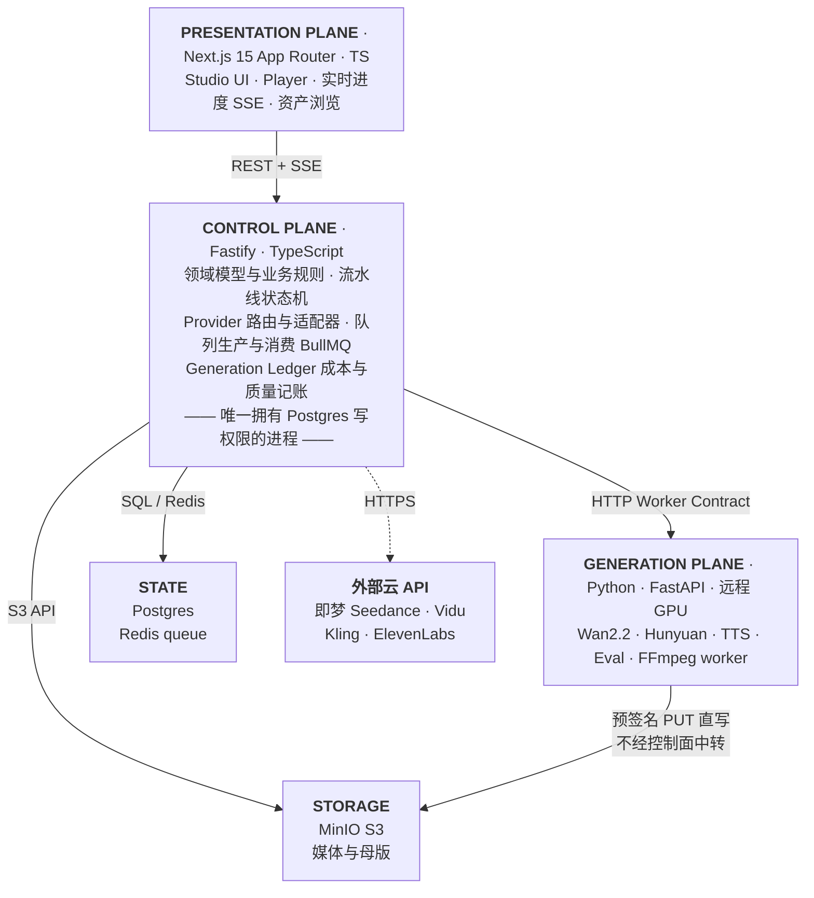
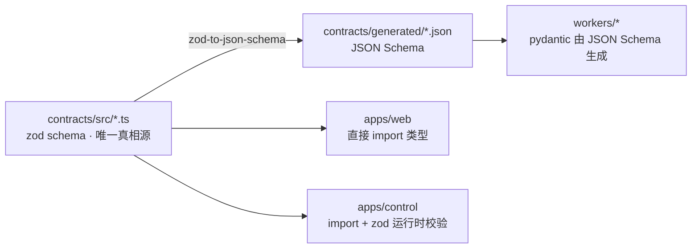
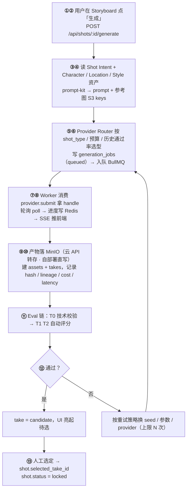
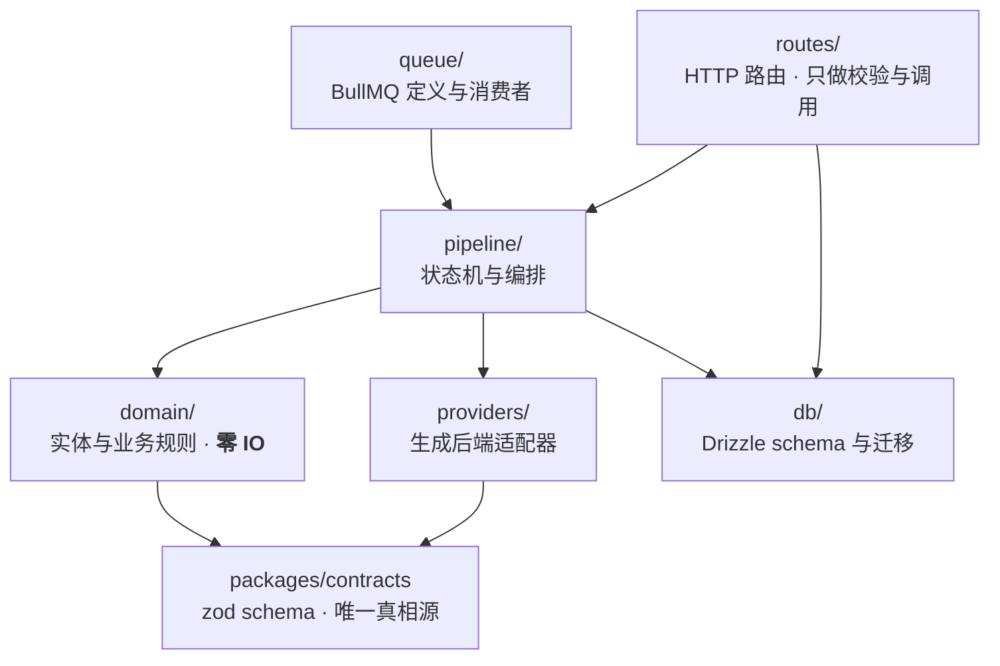
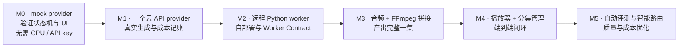

# 01 · 系统架构

> Status: Draft v1 · 2026-08-10 · 依赖：`00-overview.md`

## 1. 三平面架构

系统按**职责边界**而非技术栈切分为三个平面。跨平面只走 HTTP，绝不共享数据库连接或内存状态。



### 为什么控制面是 TypeScript 而不是 Python

领域逻辑（分集、分镜、状态机、路由、记账）和前端共享大量类型定义——Shot、Asset、JobStatus 这些类型在前后端各写一遍是纯粹的浪费和 bug 来源。用 TS 单一语言写这层，配合 monorepo 里的 `packages/contracts` 共享类型包，前端拿到的就是后端的真实类型。

而模型推理、OpenCV、FFmpeg 复杂滤镜、embedding 计算这些，Python 生态无可替代。所以边界划在「业务 vs 计算」，不划在「前 vs 后」。

## 2. 进程拓扑

### 开发态（Mac + 远程 GPU）

| 进程 | 位置 | 端口 | 说明 |
|---|---|---|---|
| `apps/web` | Mac | 3000 | Next.js dev server |
| `apps/control` | Mac | 4000 | Fastify API |
| `apps/control` (worker mode) | Mac | — | BullMQ 消费者，同代码不同入口 |
| Postgres | Mac (docker) | 5432 | |
| Redis | Mac (docker) | 6379 | |
| MinIO | Mac (docker) | 9000/9001 | S3 API + 控制台 |
| `workers/video` | 远程 GPU | 8001 | Python FastAPI |
| `workers/media` | Mac (docker) | 8002 | FFmpeg，CPU 即可 |

Mac 与远程 GPU 的连通用 **Tailscale**（推荐）或 SSH 反向隧道，见 `11-dev-setup.md`。GPU worker 直接向 MinIO 写产物——**大文件绝不经过控制面中转**，控制面只收到一个 S3 key。

> 这条规则很重要：如果生成的视频要先传回 Mac 再上传存储，Mac 的上行带宽会成为整个流水线的瓶颈。Worker 直写存储，控制面只搬运元数据。

## 3. Monorepo 目录结构

```
ai-drama-studio/
├─ apps/
│  ├─ web/                    # Next.js 15 · Studio + Player
│  │  ├─ app/
│  │  │  ├─ (studio)/         # 生产界面路由组
│  │  │  └─ (watch)/          # 播放器路由组
│  │  ├─ components/
│  │  └─ lib/
│  └─ control/                # Fastify 控制面
│     ├─ src/
│     │  ├─ domain/           # 实体与业务规则（无 IO）
│     │  ├─ pipeline/         # 状态机与编排
│     │  ├─ providers/        # 生成后端适配器
│     │  ├─ queue/            # BullMQ 定义与消费者
│     │  ├─ routes/           # HTTP 路由
│     │  └─ db/               # Drizzle schema 与迁移
│     └─ src/worker.ts        # 队列消费者入口
├─ packages/
│  ├─ contracts/              # ★ 前后端 + Python 共享的类型与 JSON Schema
│  │  ├─ src/*.ts             # TS 类型（唯一真相源）
│  │  └─ generated/*.json     # 由 TS 导出的 JSON Schema，供 Python 校验
│  ├─ ui/                     # 共享 React 组件与设计令牌
│  └─ prompt-kit/             # Shot Intent → prompt 模板引擎
├─ workers/
│  ├─ video/                  # Python · 视频生成 worker
│  ├─ media/                  # Python · FFmpeg 拼接/转码/字幕
│  └─ eval/                   # Python · 自动评测（相似度/检测）
├─ infra/
│  ├─ docker-compose.yml      # postgres + redis + minio + media worker
│  └─ gpu/                    # GPU worker 的 Dockerfile 与部署脚本
├─ docs/
└─ scripts/
```

### `packages/contracts` 是这个架构的枢纽

三种语言要对齐同一套数据结构。做法是 **TypeScript 为唯一真相源**：



用 zod 定义 schema，一次定义得到三样东西：TS 类型、运行时校验、给 Python 的 JSON Schema。`pnpm contracts:build` 是 CI 的第一步。

## 4. 数据流：一个镜头的一生



第 ⑤ 步的路由决策和第 ⑩ 步的记账，共同构成了「哪个模型在什么镜头上更划算」的数据基础。这是系统长期价值的来源，MVP 阶段就要写对。

## 5. 模块边界与依赖方向

控制面是**模块化单体**（ADR-0009），内部模块走同进程函数调用，不走网络。边界的强制手段是**构建期约束**，不是运行时协议。

### 5.1 允许的依赖方向



| 模块 | 约束 |
|---|---|
| `domain/` | **零 IO**。状态机是纯函数，副作用以 `Effect[]` 返回给调用方执行（`03-pipeline.md` §3）。这让它可以被穷举测试而无需起数据库 |
| `providers/` | 只依赖 contracts 的接口；业务代码**不得 import 任何厂商 SDK**（ADR-0002） |
| `pipeline/` | 只依赖 domain 与 providers 的接口，不直接摸 HTTP 层 |
| `routes/` | 只做参数校验与调用，**不含业务逻辑**；不得 import `domain/` 内部实现 |
| `db/` | 只有控制面进程可写（ADR-0003） |

两条禁止项（图中未画，因为它们是"不存在的边"）：`routes` 不得直连 `domain` 内部；`domain` 不得访问 `db`。

核心规矩：**模块之间只通过带显式类型的函数调用通信，不共享可变状态。** 守住这条，将来抽服务就是把函数调用换成 HTTP 调用，不需要重构领域逻辑。

### 5.2 靠构建期强制，不靠自觉

```jsonc
// eslint.config.js —— 违规 import 直接 CI 失败
"no-restricted-imports": ["error", { "patterns": [
  { "group": ["**/domain/internal/*"],
    "message": "domain 只能通过 index.ts 的公开导出访问" },
  { "group": ["**/db/*"],
    "message": "domain 必须零 IO，不得访问数据库层" },
  { "group": ["@vidu/*", "@kling/*"],
    "message": "厂商 SDK 只能出现在 providers/ 的适配器实现里（ADR-0002）" }
]}]
```

更硬的一层是 **pnpm workspace 包边界**：把 `domain` 做成独立包、只导出该导出的，"导入内部实现"在物理上就不可能。这比任何运行时协议的约束都强，且零运行时代价。

再配 `dependency-cruiser` 校验依赖方向，把 §5.1 那张图变成 CI 里的断言。

### 5.3 让边界对 AI coding agent 可读

这套约束同时服务于一个现实目标：用编码 agent 写代码时边界要稳。四条按有效性排序：

1. **仓库根 `CLAUDE.md`** 写清依赖方向与禁止事项 —— agent 每次都会读
2. **`packages/contracts` 保持唯一真相源**，schema 里写足注释 —— zod 的 `.min()` / `.enum()` / `.url()` 携带的业务约束远多于纯类型声明
3. **ESLint + dependency-cruiser 让非法依赖变成 CI 失败** —— 写错立刻有反馈，比文档管用
4. **每个 package 的 README 说明对外暴露什么、不暴露什么**

这四条给出的边界清晰度高于引入 proto/gRPC，因为它们是**可执行的约束**而非描述（论证见 ADR-0010）。

## 6. 关键架构决策摘要

完整论证见 `adr/`，此处只列结论：

| # | 决策 | 一句话理由 |
|---|---|---|
| 0001 | Monorepo + TS/Python 双语言 | 业务与计算的边界比前后端边界更本质 |
| 0002 | Provider 适配器而非直连 SDK | 模型和价格每季度变，业务逻辑不能跟着变 |
| 0003 | Postgres 为唯一真相源 | 生成任务动辄几十分钟、几美元，不能放 Redis |
| 0004 | 从第一天用 S3 兼容存储 | 本地 MinIO 与云 S3 代码零差异 |
| 0005 | GPU worker 用 HTTP 契约而非共享队列 | worker 可独立部署、独立扩缩、跨网络 |
| 0006 | 推理执行层用 ComfyUI 而非 diffusers | 性能不吃亏，而视频模型生态差距是决定性的 |
| 0007 | 编排留在 BullMQ，不上 Temporal | 难点在领域状态机而非编排引擎；已写明迁移触发条件 |
| 0008 | 角色资产按 face/body/wardrobe 三路分离 | 三类资产的构图要求与失败模式完全不同，无法用一个数组表达 |
| 0009 | 模块化单体 + 无状态计算 worker，不上微服务 | worker 是硬件边界不是有界上下文；单写者 Postgres 与微服务互斥 |
| 0010 | 跨进程用 HTTP/JSON 而非 gRPC | 只覆盖三跳中的一跳；远程 GPU 场景下可调试性权重最高 |

## 7. 演进路径

架构按「先跑通、后强化」推进，每一步都不推翻上一步：


