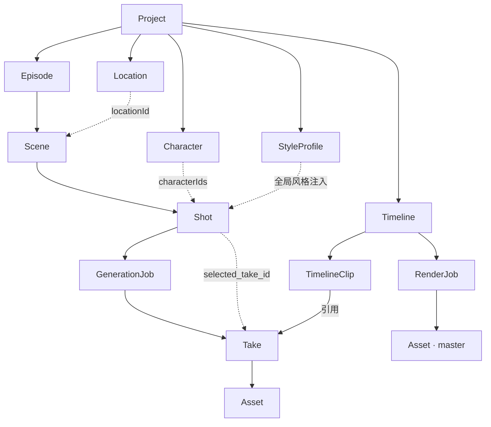

# 02 · 数据模型

> Status: Draft v1 · 2026-08-10 · 依赖：`00-overview.md` · ORM: Drizzle · DB: PostgreSQL 16

## 1. 设计原则

1. **母版不可变**：`assets` 只增不改。修改 = 新 asset + `parent_asset_id` 指回来源。
2. **生成即留痕**：每次 provider 调用都有 `generation_jobs` 一行，无论成败。
3. **一个 Shot 多个 Take**：镜头是叙事单位，Take 是产物。选片是显式动作，不是覆盖。
4. **状态是枚举，不是布尔**：一切进度用 status 枚举 + 时间戳，禁止 `is_done` 这类字段。
5. **成本以整数微美元存储**：`cost_micro_usd BIGINT`。浮点算钱迟早出问题。
6. **JSONB 装可变结构，列装可查询字段**：provider 参数放 JSONB；provider 名、模型名、状态必须是列，因为要 GROUP BY。

## 2. 实体关系



## 3. 核心表定义

### 3.1 `projects`

```ts
export const projects = pgTable('projects', {
  id:          uuid('id').primaryKey().defaultRandom(),
  title:       text('title').notNull(),
  synopsis:    text('synopsis'),
  styleProfileId: uuid('style_profile_id'),        // 全局风格，注入每个 prompt
  aspectRatio: text('aspect_ratio').notNull().default('9:16'),
  language:    text('language').notNull().default('en-US'),        // 北美 R 级为主市场，见 00-overview §2.5
  rightsRef:   jsonb('rights_ref').$type<RightsRef | null>(),   // 预留：授权链
  ownerId:     text('owner_id').notNull().default('local'),      // 预留：多用户
  status:      text('status').$type<ProjectStatus>().notNull().default('draft'),
  createdAt:   timestamp('created_at').notNull().defaultNow(),
  updatedAt:   timestamp('updated_at').notNull().defaultNow(),
})
```

### 3.2 剧本层：`episodes` / `scenes` / `shots`

```ts
export const episodes = pgTable('episodes', {
  id:          uuid('id').primaryKey().defaultRandom(),
  projectId:   uuid('project_id').notNull().references(() => projects.id, { onDelete: 'cascade' }),
  index:       integer('index').notNull(),          // 第几集，从 1 开始
  title:       text('title'),
  logline:     text('logline'),
  hook:        text('hook'),                        // 开场钩子
  cliffhanger: text('cliffhanger'),                 // 结尾悬念
  scriptMd:    text('script_md'),                   // 本集剧本原文
  targetDurationSec: integer('target_duration_sec').notNull().default(75),  // 60–90 秒区间的典型值
  status:      text('status').$type<EpisodeStatus>().notNull().default('outline'),
  createdAt:   timestamp('created_at').notNull().defaultNow(),
}, (t) => ({ uniq: unique().on(t.projectId, t.index) }))

export const scenes = pgTable('scenes', {
  id:         uuid('id').primaryKey().defaultRandom(),
  episodeId:  uuid('episode_id').notNull().references(() => episodes.id, { onDelete: 'cascade' }),
  index:      integer('index').notNull(),
  locationId: uuid('location_id'),
  timeOfDay:  text('time_of_day').$type<TimeOfDay>(),      // day|night|dawn|dusk
  summary:    text('summary'),
  stateIn:    jsonb('state_in').$type<ContinuityState>(),  // 进场可见状态
  stateOut:   jsonb('state_out').$type<ContinuityState>(), // 出场可见状态
  createdAt:  timestamp('created_at').notNull().defaultNow(),
}, (t) => ({ uniq: unique().on(t.episodeId, t.index) }))
```

`shots` 是全系统最重要的表：

```ts
export const shots = pgTable('shots', {
  id:      uuid('id').primaryKey().defaultRandom(),
  sceneId: uuid('scene_id').notNull().references(() => scenes.id, { onDelete: 'cascade' }),
  index:   integer('index').notNull(),

  // ── Shot Intent：结构化意图，不是 prompt ──
  shotType:    text('shot_type').$type<ShotType>().notNull(),  // ecu|cu|ms|ws|establishing|ots|pov
  cameraMove:  text('camera_move').$type<CameraMove>(),        // static|pan|tilt|dolly|orbit|handheld
  action:      text('action').notNull(),                       // 画面里发生什么
  emotion:     text('emotion'),
  dialogue:    text('dialogue'),                               // 本镜台词，驱动 TTS
  durationSec: numeric('duration_sec', { precision: 4, scale: 1 }).notNull().default('4.0'),

  // ── 一致性引用 ──
  characterIds: uuid('character_ids').array().notNull().default(sql`'{}'`),
  continuityFromShotId: uuid('continuity_from_shot_id'),   // 依赖的前序镜头；生成时解析其 selectedTake 末帧作首帧条件

  // ── 生成控制 ──
  // 分级：该镜头属于哪一层，以及它的降级替身
  tier:           text('tier').$type<ContentTier>().notNull().default('L1'),
  coverShotIds:   jsonb('cover_shot_ids').$type<{ L1?: string; L0?: string }>(),
  carriesPlot:    boolean('carries_plot').notNull().default(true),  // 承载剧情信息？
  safetyProfile:  text('safety_profile').$type<SafetyProfile>().notNull().default('standard'),
  providerHint:   text('provider_hint'),      // 手动指定；null = 自动路由
  promptOverride: text('prompt_override'),    // 人工覆盖生成的 prompt

  // ── 状态 ──
  status:         text('status').$type<ShotStatus>().notNull().default('draft'),
  selectedTakeId: uuid('selected_take_id'),
  attemptCount:   integer('attempt_count').notNull().default(0),

  createdAt: timestamp('created_at').notNull().defaultNow(),
  updatedAt: timestamp('updated_at').notNull().defaultNow(),
}, (t) => ({
  sceneIdx:  index('shots_scene_idx').on(t.sceneId, t.index),
  statusIdx: index('shots_status_idx').on(t.status),
}))
```

> **为什么 Shot Intent 与 prompt 必须分离**：prompt 是 provider 相关的（Wan 与 Kling 吃的提示词结构不同），Intent 是叙事相关的。分开之后，换 provider 只需换 `prompt-kit` 的模板，剧本层一个字不用改。这是 `04-provider-adapter.md` 能成立的前提。

### 3.3 一致性资产：`characters` / `locations` / `style_profiles`

三张表共用同一层骨架——描述 + 参考资产 + `version` + `lockedAt`——但参考资产的内部结构各不相同：

```ts
export const characters = pgTable('characters', {
  id:          uuid('id').primaryKey().defaultRandom(),
  projectId:   uuid('project_id').notNull().references(() => projects.id, { onDelete: 'cascade' }),
  name:        text('name').notNull(),
  description: text('description').notNull(),   // 注入 prompt 的固定描述

  // ── 三类参考资产分离（见 13-character-assets.md §2）──
  faceSet:  jsonb('face_set').$type<FaceSet | null>(),       // 多视角人脸基准
  bodyRef:  jsonb('body_ref').$type<BodyRef | null>(),       // 体型基准，去头与否按画风
  wardrobe: jsonb('wardrobe').$type<Outfit[]>().notNull().default(sql`'[]'`),

  // ── prompt 辅助 ──
  anchorTokens:       text('anchor_tokens').array().notNull().default(sql`'{}'`),
  prohibitedChanges:  text('prohibited_changes').array().notNull().default(sql`'{}'`),

  // ── 平台绑定：各家 role routing 能力与上限不同 ──
  platformBindings: jsonb('platform_bindings').$type<PlatformBindings>(),

  loraAssetId: uuid('lora_asset_id'),
  voiceId:     text('voice_id'),
  version:     integer('version').notNull().default(1),
  lockedAt:    timestamp('locked_at'),          // 三路资产齐备的闸门在此；锁定后才允许进入 S5 批量生成
  createdAt:   timestamp('created_at').notNull().defaultNow(),
})
```

```ts
interface FaceSet {
  primary:       string          // 正面 · 中性表情 · 均匀光照 · 白底
  profileLeft?:  string
  profileRight?: string
  threeQuarter:  string[]
}
interface BodyRef {
  fullBody:   string                    // 正面 + 背面全身
  headPolicy: 'keep' | 'strip'          // 写实比例取 strip（默认），风格化比例取 keep
  poseMap?:   string                    // strip + 风格化比例时必填，补几何信息
}
interface Outfit {
  id: string; name: string
  wornMasked: string             // 推荐：穿着态 + parsing mask 抠到服装区域
  flatLay?:   string             // 备选：平铺
}
interface PlatformBindings {
  vidu?:     { subjectName: string; assetIds: string[] }   // 每 subject ≤3 张
  kling?:    { elementId: string;   assetIds: string[] }   // 2–4 张
  gemini?:   { characterSlot: number }
  seedance?: { assetIds: string[] }   // 无 role，须在 prompt 显式声明同一身份
}
```

> **为什么拆成三个字段而不是一个 `reference_asset_ids` 数组**：三类资产的构图要求、质量闸门、失败模式完全不同——人脸要多视角且中性，体型的去头策略随画风变，服装要抠掉脸。放同一个数组里既无法校验也无法按平台的 role 槽位分发。完整论证见 `13-character-assets.md`。

`locations` 与 `style_profiles` 都没有 `voiceId`，也**不带** face/body/wardrobe 三路人物字段——那三路只对人成立。场景的参考图按时间/光线变体组织（全景、无人物，见 `13-character-assets.md` §2.5），另有 `interior boolean`；`style_profiles` 另有 `negativePrompt text`。

参考图集是一致性的**物理载体**——不要指望靠 prompt 复述维持角色一致，要靠固定的参考资产。

## 4. 生成记账：`generation_jobs`

这是 **C4 约束**的落地，也是全系统最有复利的一张表。

```ts
export const generationJobs = pgTable('generation_jobs', {
  id:      uuid('id').primaryKey().defaultRandom(),
  shotId:  uuid('shot_id').notNull().references(() => shots.id, { onDelete: 'cascade' }),
  attempt: integer('attempt').notNull(),

  // ── 路由与可复现性 ──
  providerId:   text('provider_id').notNull(),   // mock|vidu|kling|jimeng|selfhost-wan
  modelId:      text('model_id').notNull(),
  modelVersion: text('model_version'),
  mode:         text('mode').$type<GenMode>().notNull(),
  promptText:   text('prompt_text').notNull(),
  negativeText: text('negative_text'),
  seed:         bigint('seed', { mode: 'number' }),
  params:       jsonb('params').$type<Record<string, unknown>>().notNull(),
  inputAssetIds:uuid('input_asset_ids').array().notNull().default(sql`'{}'`),

  // ── 执行 ──
  status:         text('status').$type<JobStatus>().notNull().default('queued'),
  providerJobRef: text('provider_job_ref'),
  queuedAt:       timestamp('queued_at').notNull().defaultNow(),
  startedAt:      timestamp('started_at'),
  finishedAt:     timestamp('finished_at'),
  latencyMs:      integer('latency_ms'),

  // ── 结果与成本 ──
  costMicroUsd:  bigint('cost_micro_usd', { mode: 'number' }),
  accepted:      boolean('accepted'),
  failureCode:   text('failure_code').$type<FailureCode>(),
  failureDetail: text('failure_detail'),

  createdAt: timestamp('created_at').notNull().defaultNow(),
}, (t) => ({
  shotIdx:      index('gj_shot_idx').on(t.shotId),
  analyticsIdx: index('gj_analytics_idx').on(t.providerId, t.modelId, t.status, t.createdAt),
}))
```

典型分析查询——这就是要它的原因：

```sql
SELECT g.provider_id, s.shot_type,
       count(*)                                     AS attempts,
       avg((g.accepted)::int)::numeric(4,3)         AS pass_rate,
       sum(g.cost_micro_usd)/1e6                    AS spend_usd,
       sum(g.cost_micro_usd)/1e6
         / nullif(sum((g.accepted)::int), 0)        AS usd_per_accepted,
       percentile_cont(0.5) WITHIN GROUP (ORDER BY g.latency_ms) AS p50_ms
FROM generation_jobs g
JOIN shots s ON s.id = g.shot_id
WHERE g.finished_at > now() - interval '30 days'
GROUP BY 1, 2
ORDER BY usd_per_accepted;
```

`usd_per_accepted`（每个可用镜头的成本）才是真实单价，比「每秒多少钱」有意义得多——它把重试率算了进去。

## 5. `takes` 与 `assets`

```ts
export const takes = pgTable('takes', {
  id:      uuid('id').primaryKey().defaultRandom(),
  shotId:  uuid('shot_id').notNull().references(() => shots.id, { onDelete: 'cascade' }),
  jobId:   uuid('job_id').notNull().references(() => generationJobs.id),
  assetId: uuid('asset_id').notNull().references(() => assets.id),
  status:  text('status').$type<TakeStatus>().notNull().default('candidate'),
  evalSummary: jsonb('eval_summary').$type<EvalSummary>(),
  humanNote:   text('human_note'),
  createdAt:   timestamp('created_at').notNull().defaultNow(),
})

export const assets = pgTable('assets', {
  id:         uuid('id').primaryKey().defaultRandom(),
  projectId:  uuid('project_id').notNull().references(() => projects.id, { onDelete: 'cascade' }),
  kind:       text('kind').$type<AssetKind>().notNull(),   // image|video|audio|subtitle|lora|master
  storageKey: text('storage_key').notNull(),               // S3 key，唯一定位
  mime:       text('mime').notNull(),
  bytes:      bigint('bytes', { mode: 'number' }).notNull(),
  sha256:     text('sha256').notNull(),
  widthPx:    integer('width_px'),
  heightPx:   integer('height_px'),
  durationSec:numeric('duration_sec', { precision: 8, scale: 3 }),
  fps:        numeric('fps', { precision: 5, scale: 2 }),
  // 入库质量闸门（参考图专用，见 13-character-assets.md §2.1）
  faceDetected:     boolean('face_detected'),
  interPupillaryPx: integer('inter_pupillary_px'),         // 下限 48，安全线 100
  parentAssetId: uuid('parent_asset_id'),                  // 血缘
  producedBy:    text('produced_by').$type<ProducedBy>(),  // generation|render|upload|transcode
  createdAt:  timestamp('created_at').notNull().defaultNow(),
}, (t) => ({
  hashIdx: index('assets_sha_idx').on(t.sha256),   // 内容去重
  keyUniq: unique().on(t.storageKey),
}))
```

**S3 key 命名规范**（可读、可批量清理、天然分片）：

```
projects/{projectId}/
  refs/{characterId}/{assetId}.png          # 参考图
  takes/{shotId}/{jobId}.mp4                # 生成产物
  audio/{shotId}/{assetId}.wav              # 配音（S6 与 S5 并行，不依赖 take）
  renders/{episodeId}/normalized/{takeId}.mp4  # 规范化中间件，7 天可重建
  renders/{episodeId}/v{n}/master.mp4       # 集母版
  renders/{episodeId}/v{n}/hls/index.m3u8   # HLS 播放列表，同目录下 seg_*.ts
```

## 6. 评测：`eval_results`

```ts
export const evalResults = pgTable('eval_results', {
  id:        uuid('id').primaryKey().defaultRandom(),
  takeId:    uuid('take_id').notNull().references(() => takes.id, { onDelete: 'cascade' }),
  tier:      integer('tier').notNull(),        // 0..4，定义见 03-pipeline.md §4
  checkName: text('check_name').notNull(),     // decodable|face_present|identity_sim|...
  score:     numeric('score', { precision: 5, scale: 4 }),
  passed:    boolean('passed').notNull(),
  detail:    jsonb('detail'),
  createdAt: timestamp('created_at').notNull().defaultNow(),
}, (t) => ({ takeIdx: index('eval_take_idx').on(t.takeId, t.tier) }))
```

## 7. 剪辑与渲染：`timelines` / `timeline_clips` / `render_jobs`

```ts
export const timelines = pgTable('timelines', {
  id:        uuid('id').primaryKey().defaultRandom(),
  episodeId: uuid('episode_id').notNull().references(() => episodes.id, { onDelete: 'cascade' }),
  version:   integer('version').notNull().default(1),
  status:    text('status').$type<TimelineStatus>().notNull().default('draft'),
  createdAt: timestamp('created_at').notNull().defaultNow(),
}, (t) => ({ uniq: unique().on(t.episodeId, t.version) }))

export const timelineClips = pgTable('timeline_clips', {
  id:           uuid('id').primaryKey().defaultRandom(),
  timelineId:   uuid('timeline_id').notNull().references(() => timelines.id, { onDelete: 'cascade' }),
  index:        integer('index').notNull(),
  takeId:       uuid('take_id').references(() => takes.id),
  trimStartSec: numeric('trim_start_sec', { precision: 6, scale: 3 }).notNull().default('0'),
  trimEndSec:   numeric('trim_end_sec',   { precision: 6, scale: 3 }),
  transition:   text('transition').$type<Transition>().notNull().default('cut'),
  voiceAssetId: uuid('voice_asset_id'),
  sfxAssetIds:  uuid('sfx_asset_ids').array().notNull().default(sql`'{}'`),
  subtitleText: text('subtitle_text'),
}, (t) => ({ uniq: unique().on(t.timelineId, t.index) }))

export const renderJobs = pgTable('render_jobs', {
  id:            uuid('id').primaryKey().defaultRandom(),
  timelineId:    uuid('timeline_id').notNull().references(() => timelines.id),
  status:        text('status').$type<JobStatus>().notNull().default('queued'),
  outputAssetId: uuid('output_asset_id'),
  ffmpegLog:     text('ffmpeg_log'),
  startedAt:     timestamp('started_at'),
  finishedAt:    timestamp('finished_at'),
})
```

## 8. 状态枚举总表

集中定义在 `packages/contracts/src/enums.ts`，是三种语言的共同真相源。

```ts
export const ShotStatus = z.enum([
  'draft',      // intent 未完成
  'ready',      // intent 完整，可生成
  'generating', // 至少一个 job 在跑
  'review',     // 有 candidate take 待选
  'locked',     // 已选定 selectedTakeId
  'failed',     // 重试耗尽
  'skipped',    // 人工跳过
])

export const JobStatus = z.enum([
  'queued','submitted','running','downloading','evaluating',
  'succeeded','failed','cancelled',
])

export const ShotType       = z.enum(['ecu','cu','ms','ws','establishing','ots','pov'])
export const CameraMove     = z.enum(['static','pan','tilt','dolly','orbit','handheld'])
export const TimeOfDay      = z.enum(['day','night','dawn','dusk'])
export const TakeStatus     = z.enum(['candidate','selected','rejected','archived'])
export const AssetKind      = z.enum(['image','video','audio','subtitle','lora','master'])
export const ProducedBy     = z.enum(['generation','render','upload','transcode'])
export const GenMode        = z.enum(['t2v','i2v','ref2v','extend'])
export const SafetyProfile  = z.enum(['standard','mature'])
export const ContentTier    = z.enum(['L0','L1','L2'])   // 投放安全 / 商店安全 / 完整 TV-MA
export const HookType       = z.enum(['betrayal','reveal','conflict','cliffhanger','reversal','emotional'])
export const AdPlatform     = z.enum(['tiktok','meta_fb','meta_ig','snapchat','yt_shorts','unity'])
export const EpisodeStatus  = z.enum(['outline','scripted','shotlisted','producing','assembled','published'])
export const TimelineStatus = z.enum(['draft','locked','rendering','rendered'])
export const Transition     = z.enum(['cut','dissolve','fade_black','whip'])
export const FailureCode    = z.enum([
  'provider_error','timeout','content_filtered','quota_exceeded',
  'download_failed','eval_rejected','invalid_output','cancelled',
])
```

## 8.5 素材层：`hook_concepts` 与 `renders`

**素材不是正片的附属，是一等实体**（约束 C8）。北美的成本结构决定了素材产线才是系统主产线。

```ts
// 一个"钩子概念" = 一段有独立转化逻辑的素材创意
export const hookConcepts = pgTable('hook_concepts', {
  id:        uuid('id').primaryKey().defaultRandom(),
  projectId: uuid('project_id').notNull().references(() => projects.id, { onDelete: 'cascade' }),
  sourceEpisodeId: uuid('source_episode_id'),
  sourceTakeIds:   uuid('source_take_ids').array().notNull().default(sql`'{}'`),
  hookType:  text('hook_type').$type<HookType>().notNull(),
  // 投放归因的基础：这些标签决定能否算出 ROAS
  themeTags: text('theme_tags').array().notNull().default(sql`'{}'`),  // werewolf/ceo/revenge...
  emotionTag:text('emotion_tag'),
  summary:   text('summary').notNull(),
  tier:      text('tier').$type<ContentTier>().notNull().default('L0'),
  createdAt: timestamp('created_at').notNull().defaultNow(),
})

// 一个"渲染" = 概念 × 平台 × 时长 × 首帧 × 字幕 × 音轨 × CTA 的一个具体组合
export const renders = pgTable('renders', {
  id:        uuid('id').primaryKey().defaultRandom(),
  conceptId: uuid('concept_id').notNull().references(() => hookConcepts.id, { onDelete: 'cascade' }),
  assetId:   uuid('asset_id').notNull().references(() => assets.id),
  platform:  text('platform').$type<AdPlatform>().notNull(),
  durationSec: integer('duration_sec').notNull(),      // 9 / 15 / 21 / 30
  variantKey:  text('variant_key').notNull(),          // 首帧+字幕+音轨+CTA 的组合键
  burnedSubtitle: boolean('burned_subtitle').notNull().default(true),
  // 投放回传（由外部广告平台写入）
  impressions: bigint('impressions', { mode: 'number' }),
  installs:    integer('installs'),
  spendMicroUsd: bigint('spend_micro_usd', { mode: 'number' }),
  d0Roas:      numeric('d0_roas', { precision: 6, scale: 3 }),
  isWinner:    boolean('is_winner'),
  createdAt:   timestamp('created_at').notNull().defaultNow(),
}, (t) => ({
  conceptIdx: index('renders_concept_idx').on(t.conceptId),
  perfIdx:    index('renders_perf_idx').on(t.platform, t.isWinner, t.d0Roas),
}))
```

**为什么标签必须在生成时写入而不是事后打标**：投放侧的迭代闭环建立在「按素材标签维度看 ROAS / LTV / 留存」上。没有标签就没有归因，没有归因就只能靠感觉调创意。行业头部的做法正是按题材标签（werewolf / CEO romance / female empowerment）组织素材库。

**产能公式**（来自 Meta 大样本创意基准：约 5% 的广告成为真正的赢家）：

```
所需概念数 = 目标赢家数 ÷ 0.05
```

单部剧 40–60 条概念 ≈ 2–3 个赢家角度。**超过这个数量产出的是变体而非新概念**，边际赢家产出显著下降——一部剧的钩子存在天然上限（从 80–100 集里能提的高光约 50 条）。

## 9. 迁移与种子数据

- 迁移工具 `drizzle-kit`，迁移文件进版本库，**禁止手改线上库**。
- `pnpm db:seed` 建一个 demo project：1 集 / 3 场 / 12 镜头 / 2 角色 / 2 场景，全部指向 mock provider。这既是 M0 的验收载体，也是前端开发的固定夹具。

## 10. 预留字段说明

现在不用，但结构里留位置，避免将来改表伤筋动骨：

| 字段 | 未来用途 |
|---|---|
| `projects.rights_ref` | IP 授权链：source_id / license_scope / territory / expiry |
| `projects.owner_id` | 多用户与团队协作 |
| `shots.safety_profile` | 内容分级与差异化 provider 路由 |
| `assets.parent_asset_id` | 转码、超分、打码产生的派生版本 |
| `episodes.status = published` | 发行版本与渠道管理 |
| `characters.platform_bindings` | 已定义结构，MVP 只填当前使用的一个平台 |
