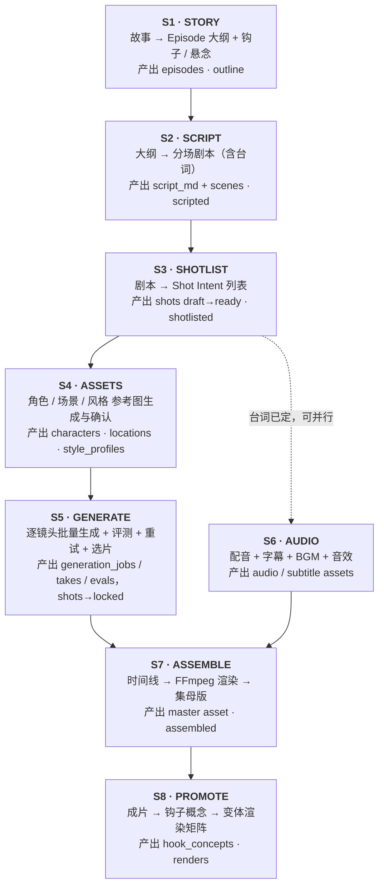
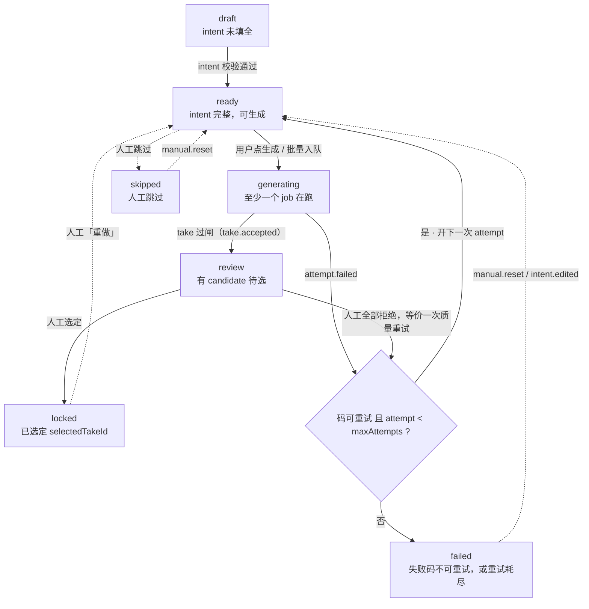

# 03 · 生产流水线与状态机

> Status: Draft v1 · 2026-08-10 · 依赖：`02-data-model.md`

## 1. 流水线全景

流水线分八个阶段。每个阶段有明确的输入、输出和「完成」判据；阶段之间可以回退，但回退必须产生新版本而不是原地修改。



S4 可以与 S3 并行；S6 可以与 S5 并行（台词在 S3 就确定了，不必等画面）。这两处并行能把一集的墙钟时间压掉三成左右。

## 2. 阶段详解

### S1 · STORY

**输入**：一句话创意，或一段已有故事。
**动作**：LLM 生成分集大纲——每集的目标、钩子、冲突、转折、悬念。
**输出**：`episodes` 行，含 `logline` / `hook` / `cliffhanger`。
**完成判据**：每一集都能用一句话说清「这集为什么让人看下一集」。

> 钩子表（hook table）是短剧的核心资产。每集的钩子类型（悬念 / 反转 / 情感 / 打脸 / 危机）要轮换，连续三集同类型会显著掉完播。这个约束写进 prompt，也写进 S1 的校验。

### S2 · SCRIPT

**输入**：Episode 大纲 + Story Bible（角色关系、世界观、已发生事件）。
**动作**：LLM 逐集生成分场剧本，输出结构化 Markdown。
**输出**：`episodes.script_md` + `scenes` 行。

剧本格式约定（便于 S3 机器解析）：

```markdown
## SCENE 1 · 咖啡馆 · 日 · 内
[STATE_IN] 林夏刚被辞退，手里攥着纸箱
陈默坐在角落，看见林夏进门。

LIN XIA: 你怎么在这。
CHEN MO: 我等你三个小时了。

[STATE_OUT] 两人重逢，林夏仍不知陈默身份
```

`[STATE_IN]` / `[STATE_OUT]` 直接映射到 `scenes.state_in/out`，是连续性校验的锚点。

### S3 · SHOTLIST

**输入**：分场剧本。
**动作**：LLM 把每场拆成 Shot Intent 序列。这是**结构化输出**，不是自由文本——用 zod schema 约束 LLM 输出。

```ts
export const ShotIntent = z.object({  // packages/contracts/src/shot.ts
  shotType:    ShotType,
  cameraMove:  CameraMove.optional(),
  action:      z.string().min(4),
  emotion:     z.string().optional(),
  dialogue:    z.string().optional(),
  durationSec: z.number().min(1).max(10),
  characterNames: z.array(z.string()),
})
```

**分级规划在分镜阶段完成，不是后期补救**（约束 C7）。两条硬规则：

1. **剧情信息与尺度画面永不同镜。** 承载对白、关键动作、道具揭示的镜头，不得同时包含需要降级的画面。违反这条，L1 版本会剧情断裂，只能重新生成——成本翻倍。
2. **每个「热点 beat」规划三个覆盖镜头**：`L2` 完整 → `L1` 同机位但遮蔽/换装/更早切出 → `L0` 反应镜头或特写脸部。AI 生成的边际成本优势正在于此：**多生成两个镜头远比重剪一场戏便宜**，增量成本约为 L2 的 10–20%；而"分开生成两版"是 80–100%。

**完成判据**（⏳ **三条都还没有校验器**——目前是写给人看的验收口径，不是系统闸门；
唯一落地的是单镜时长，两层：zod `ShotIntent.durationSec` 的软边界与数据库
`shots_duration_ck` 的硬约束。S1–S4 是 LLM 驱动的创作链路，仓里目前一行 LLM 代码都没有，
M0 的分镜数据来自 `db/seed.ts` 的 12 镜夹具）：
- 每场的镜头时长总和 ≈ 场次目标时长（±15%）。
- 单集镜头数在 10–25 之间（60–90 秒 / 2–8 秒每镜，典型 18 镜 × 4 秒）。
- 景别有变化：连续三个同景别会被校验器标黄。

### S4 · ASSETS

**输入**：剧本里出现的角色名与场景名。
**动作**：为每个角色生成三视图/立绘参考图集，为每个场景生成环境参考图，确认后锁定。
**输出**：`characters.face_set` / `body_ref` / `wardrobe`（三路分离，见 ADR-0008）、`locations`、`style_profiles`。

**这一步是全流程的一致性地基**。参考图没锁死就开始批量生成镜头，等于在流沙上盖楼——「角色设定未完成就开工」是行业公认的失败模式之一，后果是一致性问题级联放大、中途修正代价极高。S4 未完成时，S5 的批量生成入口在 UI 上必须禁用。

资产不是一张图，而是**三类结构化资产**：多视角人脸基准（face_set）、体型基准（body_ref，去头与否按画风）、抠掉脸的服装套装（wardrobe）。三者的构图要求、质量闸门与失败模式各不相同。完整设计见 `13-character-assets.md`。

### S5 · GENERATE

流水线的主体，详见 §3 的镜头状态机与 `05-job-orchestration.md`。

### S6 · AUDIO

**输入**：`shots.dialogue` + 角色 `voiceId`。
**动作**：TTS 逐镜合成 → 落 `assets(kind=audio)`；生成字幕（直接用台词文本，不做 ASR）；选配 BGM。
**注意**：**口型同步是 R 级硬指标**（见 `10-media-storage.md` §5.1）——R 级依赖表演张力（愤怒、威胁、亲密），口型不同步会直接摧毁这些镜头。对白镜头走 provider 的原生音画同步能力，没有「简化口型」这条省工序的退路。

### S7 · ASSEMBLE

**输入**：locked 的 takes + 音轨 + 字幕。
**动作**：生成 timeline → FFmpeg 渲染 → **clean 母版（不烧字幕）** + M&E 分层音轨 + HLS 切片。L1/L0 版本由 conform 服务按替换清单自动派生，人不介入。详见 `10-media-storage.md`。

### S8 · PROMOTE（素材层）

**这一步不是可选的后期营销工作，是系统的主产线。** 北美的成本结构是营销约为制作的 9 倍——正片是原材料，素材才是投出去的东西。

**输入**：成片 + shot 级元数据（情绪、冲突、角色）。
**动作**：
1. 从成片抽取 **40–60 条钩子概念**（一部剧的天然上限约 50 条，超出产出的是变体而非新概念）
2. 每条概念按「平台 × 时长 × 首帧 × 字幕 × 音轨 × CTA」矩阵派生 **8–15 个上线渲染** → 单部 400–900 个
3. 全部渲染**烧录字幕**（静音观看是常态），上三分之一、白色粗体、≤8 词、避开平台 UI 安全区
4. 商店资产**独立生成**，不从正片截帧（Apple 要求截图/预览满足 4+，即使 App 评级更高）

**素材结构**（15–30 秒档）：`钩子 0–3s → 铺垫 3–20s → 悬念 20–25s → CTA 25–30s`。前 1.5 秒决定生死，开场即最高情绪帧，不放 logo 与片头。

**尺度是留存与付费的差异化，不是获客钩子。** 投放渠道全是 PG-13 环境，尺度素材在 TikTok/Meta 直接违规、在 YouTube 进黄区、在 TikTok 自然流不进推荐。所有素材走 L0 层，用冲突与反转做钩子。

## 3. 镜头状态机（S5 的核心）



> 这张图与代码对齐过三处（issue #30）：
>
> - **删掉了 `evaluating` 节点**。`ShotStatus` 枚举里从来没有它——自动评测发生在
>   **job** 侧而不是镜头侧（`JobStatus` 里确有 `evaluating`），镜头是 `generating → review`
>   直接过去的。留着它会让人以为镜头有一个查不到的中间态。
> - **补上了 `skipped`**。枚举里有，图上原先没有任何边。
> - **重试判定加了「码可重试」这一半**。不是所有失败都会重试：`content_filtered` /
>   `quota_exceeded` / `invalid_output` / `submit_unknown` 直接判死（`05` §5.3）。
>
> ⏳ 另注意「开下一次 attempt」目前**用的是完全相同的参数**——`05` §5.2 描述的
> 「换 seed → 强化 prompt → 换 provider」还没有实现，随 provider 路由器一并落地。

状态迁移规则以纯函数实现在 `apps/control/src/pipeline/shotMachine.ts`，**不含任何 IO**，便于单测：

```ts
export function transition(
  shot: Shot,
  event: ShotEvent,
  ctx: { maxAttempts: number }
): { next: ShotStatus; effects: Effect[] } { /* ... */ }
```

所有副作用（入队、写库、发 SSE）以 `Effect[]` 返回给调用方执行。这样状态机可以被穷举测试，而不需要起数据库。

## 4. 评测五层（Eval Tiers）

生成的镜头必须过闸才能进入候选池。分层的意义是**便宜的检查先跑**——Tier 0 用几毫秒挡掉的东西，不该浪费 VLM 的钱。

| Tier | 手段 | 检查什么 | 失败动作 |
|---|---|---|---|
| **T0 · 确定性** | ffprobe / OpenCV | 能否解码、时长/帧率/分辨率是否符合请求、是否全黑帧或静帧 | 直接重试，不计入质量统计 |
| **T1 · 轻量视觉** | 人脸/主体检测、模糊度、曝光 | 该出现的人有没有出现、画面是否糊/过曝 | 低成本重试 |
| **T2 · 相似度** | 身份 embedding、场景/风格 embedding | 角色是否漂移、风格是否跑偏 | 换参考图或换 provider 重试 |
| **T3 · 语义** | VLM 打分 | 是否拍到了 intent 要求的动作与情绪 | 重写 prompt 或拆镜 |
| **T4 · 人审** | UI 选片 | 最终可用性、边界情况 | 人工决定 |

MVP 阶段只实现 **T0 + T4**（技术校验 + 人工选片）。T1–T3 的表结构和接口在 M6 之前留空跑通，避免后期改数据模型。

**阈值配置**在 `packages/contracts/src/evalPolicy.ts`，按 project 可覆盖：

```ts
export const defaultEvalPolicy = {
  t0: { requireDecodable: true, durationToleranceSec: 0.5, maxBlackFrameRatio: 0.1 },
  t2: { identitySimMin: 0.72, styleSimMin: 0.65 },
  t3: { intentMatchMin: 0.70 },
  maxAttemptsPerShot: 4,
}
```

## 5. 连续性策略

跨镜头一致性靠四个机制叠加，缺一不可：

1. **Master 资产条件化**：每个镜头都从角色/场景的 master 参考图出发生成，**绝不**把上一个镜头漂移后的产物当作下一镜的唯一真相递归下去。误差是**指数放大而非线性**的：训练时条件帧是干净的，推理时是自己生成的带误差帧，这个分布错配让误差进入模型没见过的输入域，形成正反馈——业界的通俗说法是「a copy of a copy」。
2. **末帧接首帧**：`shots.continuity_from_shot_id` 声明对前序镜头的依赖（依赖必须在前序镜头生成前就可声明，所以指向 shot 而非尚不存在的 take）。生成时解析该镜头的 `selectedTakeId`，取其末帧作为本镜的 i2v 首帧条件。用于同场连续动作。
3. **景别预算**：Wan2.2-VAE 空间压缩 16×16 叠加 DiT 的 2×2 patch，**1 个 token = 32×32 像素**。720p 全身镜头里人脸约 90px，只有约 2.8×2.8 个 token——远景人脸崩坏是 **token 预算问题，不是模型能力问题**，且 Wan2.2 比 Wan2.1 更严重。因此**身份关键镜头必须限制在中景以上**（人脸在输出帧 ≥150–200px）。全景镜头不承担身份识别；确需全景又要认脸时，提高输出分辨率或走 FaceDetailer 式两段式修复。详见 `13-character-assets.md` §5.1。
4. **状态显式记录**：`ContinuityState` 记录可见状态（服装、发型、持有物、伤痕、光线方向），注入 prompt 并在 T2/T3 校验。

```ts
export interface ContinuityState {
  characters: Record<string, {
    outfit?: string; hairstyle?: string; holding?: string[]; injuries?: string[];
  }>
  lighting?: string
  props?: string[]
  cameraDirection?: string   // 越轴检查
}
```

> 区分两个概念：**Story State** 是叙事真相（谁知道什么、关系到哪一步），**Continuity State** 是画面可见状态（穿什么、拿什么）。前者归剧本层，后者归生成层。混在一起会导致模型漂移反过来改写剧情设定。

## 6. 批量作业与并发

「生成整集」= 把该集所有 `ready` 的镜头一次性入队。

- 并发上限按 provider 配置（见 `05-job-orchestration.md`），不是全局一个数。
- 同一场次内**有 `continuityFromShotId` 依赖的镜头必须串行**——依赖的前序镜头未 locked 时，后续镜头保持 `ready` 不入队。这个依赖图在入队前做一次拓扑排序。
- 无依赖的镜头（不同场次、establishing 镜头）全部并行。

```ts
// 入队前的依赖解析
function planBatch(shots: Shot[]): { runnable: Shot[]; blocked: Shot[] } {
  const lockedIds = new Set(shots.filter(s => s.status === 'locked').map(s => s.id))
  return {
    runnable: shots.filter(s =>
      s.status === 'ready' &&
      (!s.continuityFromShotId || lockedIds.has(s.continuityFromShotId))),
    blocked: shots.filter(s =>
      s.status === 'ready' &&
      s.continuityFromShotId && !lockedIds.has(s.continuityFromShotId)),
  }
}
```

批次完成后重新解析一轮，把新解锁的镜头推进去，直到没有 runnable 为止。

> ⚠️ **自动解锁尚未实现。** 依赖解析**只在「生成整集」那一次请求里跑一次**，
> 此后没有任何调用方会重跑它——镜头 locked 走的是 `POST /api/takes/:id/select`，
> 那条路径根本不碰 `batch.ts`。所以被 `blocked` 的镜头在前序锁定后会**一直停在
> `ready`**，要人再点一次「生成整集」才进得去。
>
> 真做还有个前置：即便放行了，后续镜头也拿不到前序的末帧——`buildRequest` 的
> `refImages` 恒为空、`mode` 恒为 `t2v`。所以「末帧接首帧」和「自动解锁」是一件事的两半，
> 一起等 prompt-kit（M1 P2）。

## 7. 回退与版本

| 回退场景 | 处理方式 |
|---|---|
| 改了某镜 intent | 该镜回到 `ready`，历史 takes 保留为 `archived` |
| 改了角色参考图 | `characters.version++`；已 locked 的镜头**不自动重做**，UI 标记「资产已更新」让人决定 |
| 改了剧本 | 新建 timeline version；受影响场次的镜头标黄，不自动删除 |
| 改了风格 | 同角色参考图逻辑 |

原则：**系统永不自动销毁已经花钱生成的东西**。所有失效标记都是提示，不是删除。
