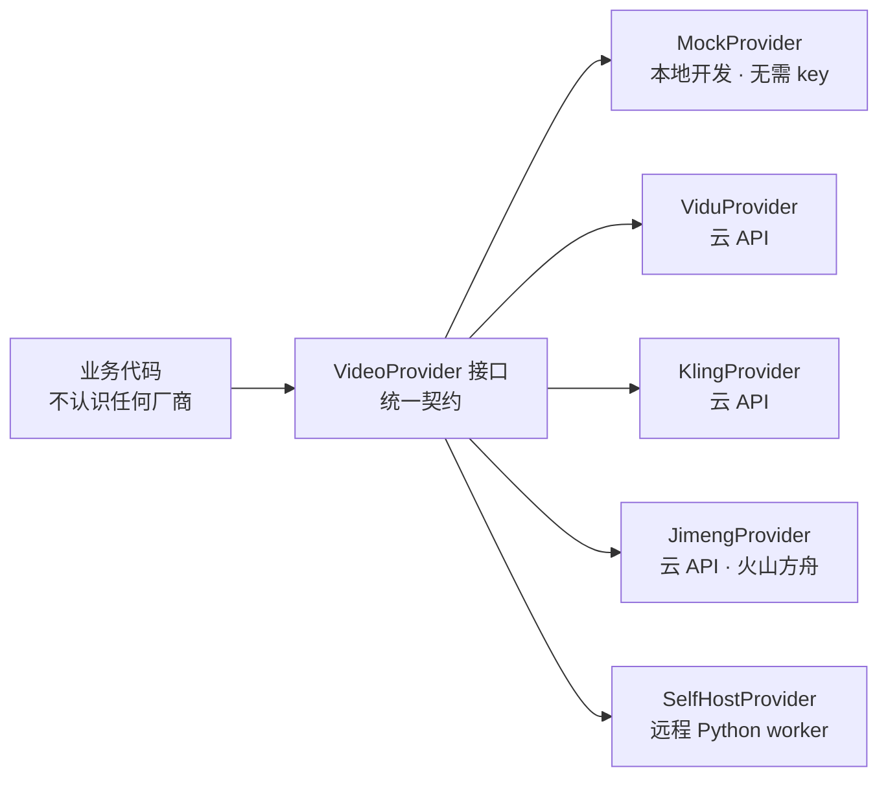

# 04 · Provider 适配器契约

> Status: Draft v1 · 2026-08-10 · 依赖：`02-data-model.md` · 对应 ADR-0002

## 1. 为什么这是最重要的一层

模型和价格每个季度都在变：托管 API 会涨价、会限流、会改政策；开源模型会有新版本、会突然闭源。如果业务代码里散落着 `import { ViduClient }`，每次变动都要改几十处。

适配器层的目标是：**业务代码永远只认识一个接口，不认识任何厂商**。



换后端的成本 = 改一行配置。这条不成立，后面所有的成本优化和质量对比都无从谈起。

## 2. 统一请求/响应模型

定义在 `packages/contracts/src/provider.ts`。所有字段都是 provider 中立的。

```ts
export const GenerationRequest = z.object({
  // ── 幂等与追踪 ──
  requestId: z.string().uuid(),        // = generation_jobs.id，用于幂等重放
  shotId:    z.string().uuid(),

  // ── 生成内容 ──
  mode:      GenMode,                  // t2v | i2v | ref2v | extend
  prompt:    z.string(),
  negativePrompt: z.string().optional(),

  // 输入图像：语义化命名，而非位置参数
  refImages: z.array(z.object({
    role: z.enum(['character','location','style','first_frame','last_frame']),
    url:  z.string().url(),            // 预签名 URL，provider 可直接拉取
    weight: z.number().min(0).max(1).optional(),
  })).default([]),

  // ── 输出规格 ──
  durationSec: z.number().min(1).max(15),
  resolution:  z.enum(['480p','720p','1080p']),
  aspectRatio: z.enum(['9:16','16:9','1:1']),
  fps:         z.number().int().default(24),
  seed:        z.number().int().optional(),

  // ── 策略 ──
  safetyProfile: SafetyProfile.default('standard'),
  priority:      z.enum(['low','normal','high']).default('normal'),
  // provider 私有参数逃生舱：只有该 provider 的适配器会读它
  providerParams: z.record(z.unknown()).default({}),
})
export type GenerationRequest = z.infer<typeof GenerationRequest>

export interface GenerationResult {
  status:      'succeeded'
  outputUrl:   string          // provider 侧可下载 URL，或已直写的 S3 key
  storageKey?: string          // 自部署 worker 直写存储时给出，控制面则跳过转存
  durationSec: number
  widthPx:     number
  heightPx:    number
  fps:         number
  seedUsed?:   number
  costMicroUsd: number         // provider 自报，不可得时由适配器按价目表估算
  providerMeta: Record<string, unknown>   // 原始响应，留档用
}

export interface ProviderFailure {
  status: 'failed'
  code:   FailureCode
  message: string
  retryable: boolean
  retryAfterMs?: number        // 限流时 provider 给的建议
}
```

### 设计要点

**`refImages` 用 `role` 而非数组下标。** 不同 provider 对参考图的语义完全不同——有的第一张是首帧，有的是主体参考。用 role 标注后，适配器负责翻译成各自的调用方式，业务层不需要知道差异。

**`providerParams` 是逃生舱。** 总会有某个 provider 的独有参数（比如某模型的 `motion_strength`）。给它一个明确的口子，好过污染通用字段。规矩是：**只有该 provider 的适配器可以读它**，业务逻辑永远不构造它（由 UI 的高级设置面板直接写入）。

**成本必须回填。** provider 不给就按适配器内置价目表估算，并在 `providerMeta.costEstimated = true` 标记。宁可要一个估算值，也不要 null——null 会让整张成本报表失真。

## 3. Provider 接口

```ts
export interface VideoProvider {
  readonly id: string                        // 'vidu' | 'selfhost-wan' | ...
  readonly capabilities: ProviderCapabilities

  /** 提交前检查：能力不匹配时快速失败，不浪费一次调用 */
  validate(req: GenerationRequest): ValidationResult

  /** 事前成本估算，用于路由决策与预算闸门 */
  estimateCost(req: GenerationRequest): number   // micro USD

  /** 提交任务。必须幂等：同 requestId 重复提交返回同一 handle */
  submit(req: GenerationRequest): Promise<ProviderHandle>

  /** 轮询状态。适配器内部负责把各家状态码映射到统一枚举 */
  poll(handle: ProviderHandle): Promise<ProviderProgress | GenerationResult | ProviderFailure>

  cancel(handle: ProviderHandle): Promise<void>

  /** 健康检查，供路由器摘除故障 provider */
  health(): Promise<{ ok: boolean; queueDepth?: number; detail?: string }>
}

export interface ProviderCapabilities {
  modes:        GenMode[]
  maxDurationSec: number
  resolutions:  Array<'480p'|'720p'|'1080p'>
  aspectRatios: Array<'9:16'|'16:9'|'1:1'>
  maxRefImages: number
  supportsSeed:      boolean
  supportsNegative:  boolean
  supportsFirstLastFrame: boolean
  supportsAudio:     boolean          // 原生音画同步
  /** 该 provider 在服务端是否有内容过滤——影响 mature 内容的路由 */
  serverSideContentFilter: boolean
  /** 并发与配额 */
  maxConcurrent: number
  costModel: { unit: 'per_second'|'per_clip'|'per_token'; microUsdPerUnit: number }
}

export type ProviderHandle = { providerId: string; externalId: string; submittedAt: number }

export interface ProviderProgress {
  status: 'submitted' | 'running'
  progressPct?: number
  etaMs?: number
}
```

## 4. 各适配器实现要点

### 4.1 `MockProvider` — 本地开发的地基

**这不是玩具，是一等公民。** 它保证「Mac 上无 GPU、无 API key 也能跑通全链路」这条硬约束（C3）。

行为规范：
- 从 `fixtures/` 里按 `shotType` 返回预置的短视频，时长裁剪到请求值。
- 模拟真实延迟：`durationSec × 8s ± 30%` 抖动。
- 按 `MOCK_FAILURE_RATE`（默认 0.15）随机失败，覆盖 `provider_error` / `timeout` / `content_filtered` 三种码——**重试逻辑必须在开发期就被真实触发过**，不能等上线才第一次遇到失败。
- `costMicroUsd` 按真实价目表量级返回，让成本报表在开发期就有数据。
- 支持 `MOCK_SEED_DETERMINISTIC=1`：同 seed 返回同一条 fixture，用于快照测试。

### 4.2 云 API 适配器（Vidu / Kling / Jimeng）

共性处理，抽到 `BaseHttpProvider`：

| 关注点 | 做法 |
|---|---|
| 认证 | key 从环境变量读，**绝不入库**；适配器内部持有，不外泄到日志 |
| 幂等 | 以 `requestId` 作为外部 idempotency key（支持的 provider）；不支持的在本地 KV 记 `requestId → externalId` 映射 |
| 限流 | 429 时读 `Retry-After`，回传 `retryAfterMs`，由队列层做退避，不在适配器里 sleep |
| 参考图 | 生成 MinIO 预签名 URL（TTL 1h）交给 provider 拉取；provider 不支持 URL 的才走 base64 上传 |
| 错误映射 | 每家的错误码在适配器内映射到 `FailureCode`，业务层只见统一枚举 |
| 产物转存 | 云 API 产物由控制面下载后写入 MinIO，校验 sha256，再建 asset 行 |
| 内容过滤 | `serverSideContentFilter: true`。被过滤返回 `content_filtered`（**不可重试**——同样的 prompt 重试只会再被拒一次，浪费配额） |

> 错峰调度：部分 provider（如 Vidu）有明显的错峰折扣。适配器暴露 `estimateCost` 时应读取当前时段，路由器据此把低优先级批量任务推到便宜时段。这个能力 M6 再启用，接口先留好。

### 4.3 `SelfHostProvider` — 远程 Python worker

其内部推理由 **ComfyUI 无头服务**执行（见 `adr/0006-comfyui-over-diffusers.md`）——但这对控制面完全透明：适配器之后是 diffusers 还是 ComfyUI，业务代码不感知，这正是本层存在的意义。

与云 API 的三个关键差异：

1. **直写存储**：worker 生成完直接 PUT 到 MinIO，返回 `storageKey`。控制面不下载、不中转。这是 `01-architecture.md` §2 强调的那条规则。
2. **无服务端内容过滤**：`serverSideContentFilter: false`。责任完全在应用层的 Eval 与发行策略。
3. **健康与容量可见**：`health()` 返回真实 GPU 显存、已加载模型、队列深度，路由器可据此做容量感知调度。

```ts
export class SelfHostProvider implements VideoProvider {
  constructor(private baseUrl: string, private modelId: string) {}
  // POST {baseUrl}/v1/generate  → { job_id }
  // GET  {baseUrl}/v1/jobs/{id} → { status, progress, result }
  // 协议定义见 09-python-worker.md
}
```

## 5. Provider 路由器

```ts
export interface RoutingContext {
  shot: Shot
  attempt: number
  previousFailures: FailureCode[]
  budgetRemainingMicroUsd?: number
  priors: ProviderPriors        // 来自 generation_jobs 的历史统计
}

export function routeProvider(ctx: RoutingContext, pool: VideoProvider[]): VideoProvider
```

决策顺序（**规则优先，统计其次**——先保证正确，再谈优化）：

1. **硬约束过滤**：`shot.providerHint` 指定则直接用；否则筛掉 `validate()` 不通过、`health()` 不健康、能力不匹配（如需要 `supportsFirstLastFrame` 但不支持）的。
2. **安全画像过滤**：`safetyProfile = 'mature'` 时只保留 `serverSideContentFilter === false` 的 provider（即自部署）。这是 MVP 不启用、但架构必须留位的一条规则。
3. **失败规避**：本镜已在某 provider 上失败过 `content_filtered`，把它排到最后。
4. **统计排序**：按 `usd_per_accepted`（该 `shotType` 上的历史每可用镜头成本）升序。样本不足 30 时退化为固定优先级配置。
5. **预算闸门**：`estimateCost` 超出剩余预算则降级到更便宜的 provider 或拒绝入队。

`ProviderPriors` 由一个每 15 分钟刷新的物化视图提供，查询就是 `02-data-model.md` §4 那条 SQL。

## 6. 注册与配置

```ts
// apps/control/src/providers/registry.ts
export function buildProviderPool(env: Env): VideoProvider[] {
  const pool: VideoProvider[] = [new MockProvider(env)]
  if (env.VIDU_API_KEY)  pool.push(new ViduProvider(env.VIDU_API_KEY))
  if (env.KLING_API_KEY) pool.push(new KlingProvider(env.KLING_API_KEY))
  if (env.JIMENG_API_KEY) pool.push(new JimengProvider(env.JIMENG_API_KEY))
  if (env.SELFHOST_VIDEO_URL)
    pool.push(new SelfHostProvider(env.SELFHOST_VIDEO_URL, env.SELFHOST_MODEL ?? 'wan2.2-ti2v-5b'))
  return pool
}
```

`.env` 里没配的 provider 自动不进池子。开发默认只有 mock，`DEFAULT_PROVIDER=mock` 强制指定，避免误刷云账单。

## 7. 适配器的测试要求

每个新 provider 必须通过同一套契约测试 `providers/__tests__/contract.spec.ts`：

| 用例 | 断言 |
|---|---|
| 幂等提交 | 同 `requestId` 连提两次，`externalId` 相同，只产生一次计费 |
| 能力声明一致 | `capabilities` 里声明支持的每种 mode 都能真实提交成功 |
| 超能力请求 | 请求 15s 但 `maxDurationSec=10` → `validate()` 返回失败，且**不发起网络调用** |
| 取消 | 提交后立即 cancel，最终状态为 `cancelled`，不产生 take |
| 错误映射 | 注入 429 / 5xx / 内容拒绝，分别映射到正确的 `FailureCode` 与 `retryable` |
| 成本非空 | 成功结果的 `costMicroUsd > 0` |

云 provider 的契约测试用录制回放（nock/msw fixtures）跑，CI 不烧真钱；带 `--live` 标记时才打真实 API，仅本地手动执行。
