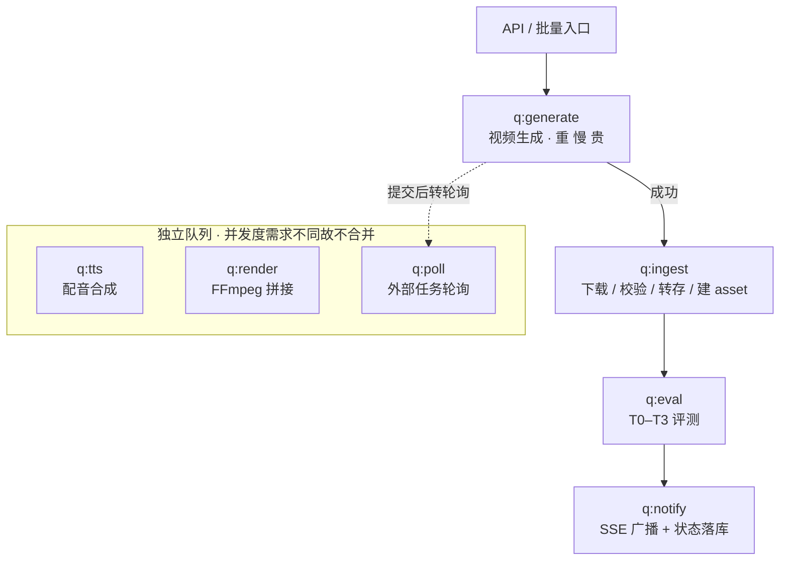
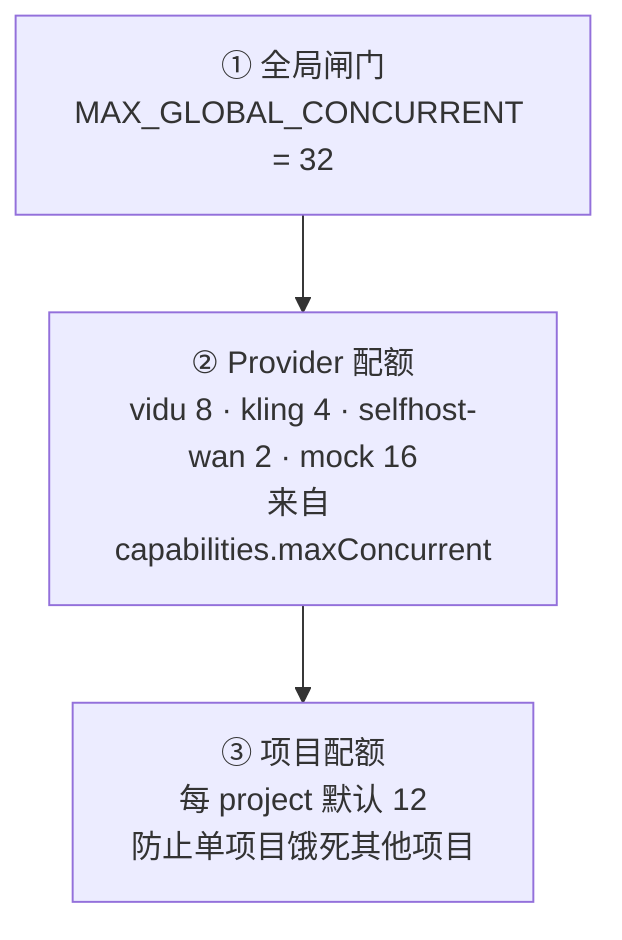
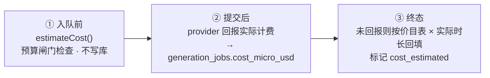

# 05 · 任务编排：队列、重试、并发与记账

> Status: Draft v1 · 2026-08-10 · 依赖：`03-pipeline.md`、`04-provider-adapter.md`

## 1. 为什么需要一个真正的队列

一次视频生成耗时几十秒到几分钟、花几毛到几美元、随时可能失败。这类任务有三个特点决定了不能用「HTTP 请求里 await」的写法：

- **长**：远超 HTTP 超时，必须异步。
- **贵**：进程重启不能丢，必须持久化，必须幂等。
- **多**：一集 10–25 镜、一部剧 800–2500 镜，必须有并发控制和优先级。

所以：**BullMQ（Redis）做队列，Postgres 做真相源**。Redis 里的任务可以丢——重启后从 Postgres 里 `status IN ('queued','submitted','running')` 的记录重建即可。反过来不行：**永远不要把价值几美元的任务状态只存在 Redis 里**。

## 2. 队列拓扑



拆成多队列而不是一个大队列的理由：**并发度需求完全不同**。`q:generate` 受 provider 配额约束（可能只有 4），`q:ingest` 是 IO 密集（可以 20），`q:render` 是 CPU 密集（等于核数）。混在一起就只能取最小值，浪费吞吐。

## 3. 并发控制：三层限流



BullMQ 用 `Worker` 的 `concurrency` 实现第 ①③ 层；第 ② 层用 **BullMQ Group / 自建信号量**按 `providerId` 分组限流。

```ts
const generateWorker = new Worker<GenerateJobData>('q:generate', handler, {
  connection,
  concurrency: env.MAX_GLOBAL_CONCURRENT,
  limiter: { max: 32, duration: 1000 },       // 令牌桶，防瞬时打爆
})

// provider 级信号量（Redis 实现，跨进程有效）
await withProviderSlot(providerId, capabilities.maxConcurrent, async () => {
  return provider.submit(req)
})
```

## 4. 轮询策略

云 provider 大多不支持 webhook（或 webhook 需要公网回调，本地开发不可用），所以统一用**轮询**。

关键设计：**不要为每个任务开一个常驻轮询循环**。一集 10–25 个镜头，多集并行时就是几百个循环，Redis 连接和 CPU 都会被吃掉。

做法是**自重排的轮询任务**：

```ts
// q:poll 的 handler
async function pollHandler(job: Job<PollJobData>) {
  const { generationJobId, handle, pollCount } = job.data
  const res = await provider.poll(handle)

  if (res.status === 'running' || res.status === 'submitted') {
    // 指数退避重排自己：3s → 5s → 8s → ... 上限 30s
    const delay = Math.min(3000 * Math.pow(1.4, pollCount), 30_000)
    if (elapsed(handle) > PROVIDER_TIMEOUT_MS) throw new TimeoutError()
    await pollQueue.add('poll', { ...job.data, pollCount: pollCount + 1 }, { delay })
    await publishProgress(generationJobId, res.progressPct)
    return
  }
  // 终态：转交 q:ingest 或标记失败
  await handleTerminal(generationJobId, res)
}
```

同一时刻内存里没有任何挂起的循环，只有 Redis 里的延时任务。这样几千个并行任务也不会压垮进程。

## 5. 重试策略

重试分两类，**必须区别对待**——这是最容易写错的地方。

### 5.1 基础设施重试（同参数重放）

网络抖动、502、超时。**同样的参数重试是合理的**。

```ts
{ attempts: 3, backoff: { type: 'exponential', delay: 2000 } }   // 2s, 4s, 8s
```

由 BullMQ 自动处理，**不增加** `shots.attemptCount`，也不写新的 `generation_jobs` 行——它在语义上还是同一次生成尝试。

### 5.2 生成质量重试（换参数重生成）

评测未通过、画面崩坏、角色跑偏。**同样的参数重试毫无意义**，必须改变输入。

由状态机驱动，每次产生**新的 `generation_jobs` 行**，`attempt` 递增。

> **三级里第一级已落地，另外两级的钩子也在了。**
>
> | 级别 | 状态 |
> |---|---|
> | 换 seed（attempt ≥ 2）| ✅ 已实现（`pipeline/applyTransition.ts`）|
> | 强化 prompt | ⏳ 等 `prompt-kit`——现在的 prompt 只是 `action + shotType` 拼串，没有可强化的结构 |
> | 换 provider | ⏳ 池里只有 mock。但**规避逻辑已经在跑**：路由器会把本镜被 `content_filtered` 过的那家排到最后（`04` §5 第 3 步），池里一有第二个可选项就自动生效 |
>
> 此前三级一个都没有：每次重试用完全相同的 seed / prompt / provider 重投，
> 一个镜头以同一组参数连撞 4 次然后判死——本节开头那句「同样的参数重试毫无意义」
> 描述的正是当时的实际行为。

| attempt | 策略 |
|---|---|
| 1 | 原参数（首次） |
| 2 | 换 seed |
| 3 | 换 seed + 强化 prompt（追加质量词与负向词） |
| 4 | 换 provider（按路由器次优选择） |
| ≥5 | 停止，`shot.status = 'failed'`，等人工介入 |

```ts
export function nextAttemptPlan(prev: GenerationJob, attempt: number): Partial<GenerationRequest> {
  switch (attempt) {
    case 2: return { seed: randomSeed() }
    case 3: return { seed: randomSeed(), prompt: reinforce(prev.promptText),
                     negativePrompt: mergeNegatives(prev.negativeText) }
    case 4: return { seed: randomSeed(), /* provider 由路由器换 */ }
    default: throw new MaxAttemptsExceeded()
  }
}
```

### 5.3 不可重试的失败

| FailureCode | 为什么不重试 |
|---|---|
| `content_filtered` | 同 prompt 必然再被拒，纯烧配额。需人工改 intent |
| `quota_exceeded` | 重试加剧问题。应暂停该 provider 并告警 |
| `invalid_output` | 适配器 bug 或能力不匹配，重试无用，需修代码 |
| `submit_unknown` | **可能已经计费**。提交请求发出后连接断了，或进程死在提交与记账之间；云 provider 普遍不提供幂等键（`04-provider-adapter.md` §5），所以既问不出来也不能安全重放。自动重投 = 可能付第二次钱 |

这四种直接进人工队列，**不进重试循环**。出口是 `POST /api/shots/:id/reset`（发 `manual.reset`）——没有这个出口，不可重试就等于只能手工改库。

> **名单是白名单，不是黑名单。** `isRetryable` 用 `RETRYABLE` 正列可重试的码，其余一律不重试。
> 因为这个返回值直接决定要不要自动开下一次 attempt，而下一次 attempt 就是下一笔钱——
> 黑名单的默认值是「花钱」，任何人加新码而忘了同步名单，系统就替他自动重投。

## 6. 成本记账

每个任务在三个时刻写成本：



### 6.1 失败也要记账

**这是 M0 遗留下来最贵的一个假设。** mock 的失败不花钱，于是「失败 = 免费」这条
从来没有被检验过；而真 provider 对失败、超时、取消的生成照样计费——算力已经消耗掉了。

五个失败入口各是一种事实，不能一刀切：

| 入口 | 花钱了吗 | 写什么 |
|---|---|---|
| 能力校验不通过（`validate` 前置） | **没有**。`validate` 不得有 IO，一次调用都没发生 | `0`，非估算 |
| provider 回报失败且带了金额 | 是，且**它知道确切数字** | 真数，非估算 |
| provider 回报失败但没带金额 | 多半是。没报 ≠ 免费 | 估算值，标 `cost_estimated` |
| 超时 | 是。任务真跑了十几分钟，且 `cancel` 是 best-effort，可能还在烧 | 估算值，标 `cost_estimated` |
| 提交结果未知（`submit_unknown`） | **不知道** | 估算值，标 `cost_estimated` |

最后一行是个两难：记 `0` 会让预算闸门失效（闸门读的就是 `cost_micro_usd` 的和），
记成真账则是 Ledger 在说谎。`cost_estimated` 让两者同时成立——闸门照样把它算进
今日花费，报表能把估算与真实计费分开显示。没有这一列，只能二选一。

**预算闸门**在项目级：

```ts
export interface BudgetPolicy {
  projectDailyLimitMicroUsd: number
  episodeLimitMicroUsd:      number
  onExceed: 'block' | 'warn' | 'downgrade_provider'
}
```

超限时 `block` 会让批量入队直接失败并在 UI 弹出，而不是安静地烧钱。开发期默认 `projectDailyLimitMicroUsd = 5_000_000`（$5），**防止一次误操作把整批任务打到云 API**。这条在 M1 接真实 provider 时尤其重要。

## 7. 实时进度：SSE

前端订阅 `GET /api/projects/:id/events`（SSE），控制面从 Redis pub/sub 转发。

```ts
type StudioEvent =
  | { type: 'shot.status',    shotId: string, status: ShotStatus }
  | { type: 'job.progress',   jobId: string, shotId: string, pct: number, etaMs?: number, stage?: GenStage }
  | { type: 'take.created',   shotId: string, takeId: string, thumbUrl: string }
  | { type: 'batch.progress', episodeId: string, done: number, total: number, failed: number }
  | { type: 'cost.updated',   projectId: string, spentMicroUsd: number }
  | { type: 'error',          shotId?: string, code: FailureCode, message: string }
```

选 SSE 不选 WebSocket 的理由：进度是**单向广播**，SSE 够用且天然支持断线重连与 HTTP/2 多路复用，不需要维护双向连接的状态机。有交互需求（比如协同编辑）时再上 WS 不迟。

节流：`job.progress` 每个 job 最多 1 秒 1 条，服务端合并后再发，避免几十个任务同时刷把浏览器打爆。

**发出点是 `handlePoll` 的 running 分支**：`provider.poll()` 返回的 `progressPct` / `stage` 必须转成事件，否则整条链路是死的——契约有、节流有、前端进度条在等，就是没人发。这个洞真实存在过，mock 跑得太快所以一直没暴露。

**`stage` 不是锦上添花。** 取值 `queued | loading_model | denoising | decoding | uploading`，来自 Worker Contract 的 `JobState.stage`（`09` §2.3），源头是 ComfyUI 的进度事件。ComfyUI 首次加载 14B 权重要 60–90 秒，这期间 `pct` 一直是 0——只画一条不动的进度条，用户读到的是「挂了」，于是去点重试，而重试会把模型再加载一遍。所以 `pct` 缺省时也要发事件：**「加载模型中」配一条不动的 0% 条是「系统在忙」，什么都不发是「系统死了」**，这两者在 `07` §2 R1 下完全不同。

云 provider 给不出阶段就留空，界面退回纯百分比。

## 7.5 BullMQ 生产加固（三条必改的默认值）

选型论证见 `adr/0007-bullmq-over-temporal.md`。留在 BullMQ 的前提是把这三个默认值改掉：

| 项 | 默认值的问题 | 改法 |
|---|---|---|
| **Redis 淘汰策略** | 默认会在内存压力下淘汰 key，队列直接损坏 | `maxmemory-policy=noeviction`，并开 AOF；worker 侧 `maxRetriesPerRequest: null` |
| **`maxStalledCount`** | 默认 **1** —— 一次 stall 就直接判失败 | 长任务场景调高，并确保 processor 不长时间阻塞 event loop |
| **不要在 job 里同步等生成完成** | 占满 worker 槽位、lock 续期依赖 event loop 让出、网络抖动即丢任务（而 GPU 上钱已经花了） | **提交即返回**：job A 提交 → 写 Postgres(submitted) → 立刻完成；轮询走 `q:poll` 的自重排延时任务（§4） |

第三条本设计已经是对的（§4 的自重排轮询），此处显式写成规则，避免后续实现时退化。

> 另一条边界：**不要用 bullmq-python 连接 GPU worker**。Python 版仍标 experimental，且语言边界走 HTTP 契约（`09-python-worker.md`）能让将来更换编排器时只动 TypeScript 一侧。

## 8. 崩溃恢复

控制面重启时执行 reconcile：

```ts
async function reconcileOnBoot() {
  // 1. 捞出所有非终态任务
  const stuck = await db.select().from(generationJobs)
    .where(inArray(generationJobs.status, ['queued','submitted','running','downloading','evaluating']))

  for (const job of stuck) {
    if (!job.providerJobRef) {
      // 从未提交成功 → 直接重新入队（幂等键保证不会重复计费）
      await generateQueue.add('generate', { generationJobId: job.id })
    } else {
      // 已提交 → 恢复轮询，不重新提交
      await pollQueue.add('poll', { generationJobId: job.id, handle: rebuildHandle(job), pollCount: 0 })
    }
  }
}
```

**幂等是这套恢复逻辑成立的前提**——`04-provider-adapter.md` §7 把幂等列为契约测试的第一条，原因就在这里。

## 9. 可观测性

三个必须有的面板（质量与成本两块即 M1 的洞察页 v1；吞吐面板早期可以只是几条 SQL）：

| 面板 | 关键指标 |
|---|---|
| **吞吐** | 队列深度、各 provider 在途数、p50/p95 端到端延迟 |
| **质量** | 一次通过率（按 provider × shotType）、重试分布、失败码分布 |
| **成本** | 今日/本集花费、`usd_per_accepted`、估算 vs 实际偏差 |

日志用结构化 JSON，每条带 `projectId / episodeId / shotId / generationJobId / providerId`，便于按任意维度串起来查。
