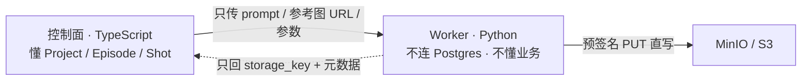
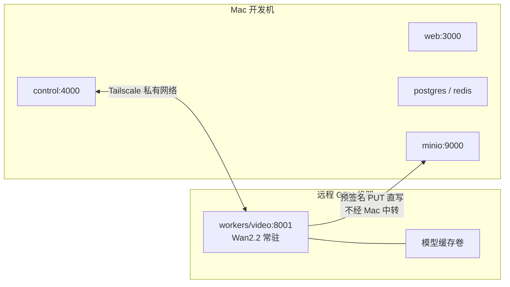

# 09 · Python 生成 Worker 与远程 GPU 部署

> Status: Draft v1 · 2026-08-10 · 依赖：`04-provider-adapter.md` · 对应 ADR-0005

## 1. 职责边界

Python 侧只做一件事：**把一个生成请求变成一个存储对象**。它不知道 Project、Episode、Shot 是什么，不连 Postgres，不做业务判断。



这条边界让 worker 可以独立部署、独立扩缩、随时被 mock 掉，也让 GPU 机器不需要访问数据库（安全上也更干净）。

## 2. Worker Contract

三个 worker 共用同一套协议骨架，只是 `/v1/generate` 的载荷不同：

| Worker | 端口 | 职责 | 硬件 |
|---|---|---|---|
| `workers/video` | 8001 | 文生视频 / 图生视频 | GPU（远程） |
| `workers/media` | 8002 | FFmpeg 拼接、转码、字幕烧录 | CPU（本机 docker） |
| `workers/eval` | 8003 | T0–T2 自动评测 | CPU / 轻量 GPU |

### 2.1 接口

```
POST   /v1/generate         提交任务 → { job_id }
GET    /v1/jobs/{job_id}    查询状态
POST   /v1/jobs/{job_id}/cancel
GET    /v1/models           已加载模型清单
GET    /v1/health           健康与容量
```

### 2.2 请求体

```python
class GenerateRequest(BaseModel):
    request_id: str          # = generation_jobs.id，幂等键
    mode: Literal['t2v', 'i2v', 'ref2v', 'extend']
    model_id: str            # 'wan2.2-i2v-a14b' | 'hunyuan-1.5-t2v' | ...
    prompt: str
    negative_prompt: str | None = None
    ref_images: list[RefImage] = []          # role + url（预签名，可直接拉取）
    duration_sec: float = Field(ge=1, le=15)
    resolution: Literal['480p', '720p', '1080p'] = '720p'
    aspect_ratio: Literal['9:16', '16:9', '1:1'] = '9:16'
    fps: int = 24
    seed: int | None = None
    steps: int | None = None                  # None → 用模型默认
    guidance_scale: float | None = None
    # 产物落点由控制面指定，worker 直写
    output: OutputSpec                        # { bucket, key, presigned_put_url }
```

**`presigned_put_url` 是关键设计**：控制面预先签一个 PUT URL 给 worker，worker 直接上传。GPU 机器不需要任何 S3 凭证，也不需要能反连控制面的存储网络。

### 2.3 响应体

```python
class JobState(BaseModel):
    job_id: str
    request_id: str
    status: Literal['queued','running','uploading','succeeded','failed','cancelled']
    progress_pct: float | None = None        # 0..100，来自 diffusion step 回调
    stage: str | None = None                 # 'loading_model'|'denoising'|'decoding'|'uploading'
    eta_ms: int | None = None
    result: GenerateResult | None = None
    error: WorkerError | None = None

class GenerateResult(BaseModel):
    storage_key: str
    bytes: int
    sha256: str
    width_px: int
    height_px: int
    duration_sec: float
    fps: float
    seed_used: int
    # 用于成本核算：控制面按 GPU 时价 × 秒数折算
    gpu_seconds: float
    gpu_model: str                            # 'H100-80GB' | 'RTX4090' | ...
    model_version: str
```

`gpu_seconds` 让自部署路径也能进 Generation Ledger 的成本对比——没有它，自部署 vs 云 API 的成本比较就无从谈起。

### 2.4 健康检查

```python
class Health(BaseModel):
    ok: bool
    gpu_model: str
    vram_total_mb: int
    vram_free_mb: int
    models_loaded: list[str]
    queue_depth: int
    max_concurrent: int
    uptime_sec: int
```

`SelfHostProvider.health()` 直接透传，路由器用 `vram_free_mb` 和 `queue_depth` 做容量感知调度。

## 3. 内部结构

```
workers/video/
├─ app/
│  ├─ main.py            FastAPI 入口
│  ├─ api.py             路由
│  ├─ schemas.py         pydantic 模型（由 contracts JSON Schema 生成）
│  ├─ queue.py           进程内异步队列 + 信号量
│  ├─ storage.py         预签名 PUT 上传 + sha256 流式计算
│  └─ engines/
│     ├─ base.py         Engine 抽象
│     ├─ wan22.py        Wan2.2 (diffusers)
│     ├─ hunyuan15.py    HunyuanVideo 1.5
│     └─ mock.py         无 GPU 的假引擎，用于 CI
├─ Dockerfile
└─ pyproject.toml
```

### 3.1 推理执行层：ComfyUI（见 ADR-0006）

worker 内部不直接写 diffusers 推理代码，而是把 **ComfyUI 作为无头服务**跑在同一容器里，通过 HTTP 提交工作流。

```
Worker (你的代码 · 唯一对外接口)
  │  localhost:8188（仅容器内，永不暴露）
  ▼
ComfyUI 进程
```

**为什么**：性能不吃亏（实测常快于 diffusers）；Wan2.2 全系含 **FLF2V 首尾帧**、**Wan Animate 2**（参考角色 + 驱动表演 → 一致动画）、HunyuanVideo 1.5 都是官方原生节点，直接命中本项目最难的连续性与角色一致性问题；效果迭代可在 GUI 完成后导出 JSON，不占工程排期。完整论证与三条硬约束见 `adr/0006-comfyui-over-diffusers.md`。

**交互的四个端点**：

| 端点 | 用途 |
|---|---|
| `POST /prompt` | 提交工作流。**同步返回图校验结果**（缺模型、类型不匹配会立刻报 `node_errors`），可当 schema 校验用 |
| `WS /ws?clientId=` | 进度。收到 `executing` 且 `node is None` 即该任务结束 |
| `GET /history/{prompt_id}` | **结果查询主力**，也是 WS 断线的兜底——WS 无补发机制，必须双轨 |
| `POST /free` | `{"unload_models":true,"free_memory":true}`，显存治理 |

**工作流即版本化工件**。美术在 GUI 里迭代 → `Workflow > Export (API)` 导出 **API 格式** JSON（与 UI 格式结构完全不同，UI 格式不能提交）→ 进 git，与镜像 tag 绑定。

**参数注入不要硬编码 node id**（改图就变）。约定把需暴露的节点重命名为 `@input.prompt` / `@input.seed` / `@input.ref_image`，worker 按 `_meta.title` 前缀寻址。**seed 必须显式注入**——节点里的 `control_after_generate` 是纯前端逻辑，API 模式下不生效。

### 3.2 运行时防护（必须实现）

ComfyUI 的显存管理器是"自动挡"且**在持续被重写**，跨版本行为会变，直接表现为生产任务 OOM。五条防护：

1. **OOM 后重启进程，而不是重试请求** —— OOM 后显存状态不可靠
2. **每 N 个任务（建议 20–50）计划性重启** ComfyUI 子进程
3. **`/system_stats` 做显存 canary** —— 空闲时 free VRAM 相比基线持续下降即判定泄漏
4. **切换工作流类型时主动 `/free`**
5. **按模型分池调度** —— 同一 worker 不要交替跑不同大模型，模型 swap 在异常路径下可退化到每次从磁盘重读（百秒级）。worker 打 tag，控制面按 tag 路由。**这是最高 ROI 的一条**

**边界**：插帧、上采样、编码**不放进 ComfyUI**。它们是确定性后处理，放 worker 自己的代码里更好测试、可用更便宜的算力，且不占用串行队列里稀缺的大显存时间。

### 3.3 Engine 抽象

```python
class VideoEngine(ABC):
    model_id: str
    @abstractmethod
    def load(self) -> None: ...
    @abstractmethod
    def generate(self, req: GenerateRequest,
                 on_progress: Callable[[float, str], None]) -> LocalArtifact: ...
    @abstractmethod
    def vram_required_mb(self) -> int: ...
```

**模型常驻内存，不要每次请求加载。** 冷启动加载 A14B 级模型要几十秒，占端到端时间的大头。worker 启动时按 `PRELOAD_MODELS` 预加载，并用信号量限制并发数（由显存决定，通常 1–2）。

### 3.4 并发与显存

```python
# 单卡通常只跑 1 个大模型任务；小模型可以 2
MAX_CONCURRENT = int(os.getenv('MAX_CONCURRENT', '1'))
_sem = asyncio.Semaphore(MAX_CONCURRENT)
```

超出并发的请求进 worker 内部队列并在 `/v1/jobs/{id}` 返回 `queued` 状态。**不要拒绝请求**——控制面已经做过一层限流，worker 侧再拒绝会让重试逻辑复杂化。

### 3.5 进度回调

diffusers 的 `callback_on_step_end` 直接映射到 `progress_pct`：

```python
def _cb(pipe, step: int, timestep, kwargs):
    on_progress(step / total_steps * 90, 'denoising')   # 留 10% 给解码与上传
    return kwargs
```

有真实进度这件事对 UI 很重要（`07-design-system.md` R1）——用户能看着百分比走，和干等转圈是完全不同的体验。

## 4. 模型选型与许可

| 模型 | 许可 | 显存 | 定位 |
|---|---|---|---|
| **Wan2.2 TI2V-5B** | Apache 2.0 | ~24GB（720p） | 主力：单卡可跑，性价比最高 |
| **Wan2.2 I2V-A14B** | Apache 2.0 | ~80GB（或 offload） | 质量优先，H100 级 |
| **HunyuanVideo 1.5** | 腾讯社区许可 | ~14GB（offload 开） | 备选：显存友好，4090 可跑 |
| **Index-AniSora** | Apache 2.0 | 视版本 | 动画风专用 |

> 许可注意：Wan 系列 Apache 2.0 最干净，官方声明不主张生成内容权利。HunyuanVideo 1.5 的社区许可**排除欧盟/英国/韩国**，且 MAU 超 1 亿需另行申请——纯本地开发无影响，但主体和服务器所在地要留意。Wan 2.5 之后转闭源，自部署路线锁定在 2.2 分支。

`engines/` 下每个实现的文件头必须注明许可与来源 URL，方便后续审计。

## 5. 部署：远程 GPU

### 5.1 拓扑



**Tailscale 是推荐方案**：装完两端都有稳定私有 IP，NAT 穿透自动完成，不用公网暴露端口，不用配置反向代理。

```bash
# 两端各执行
curl -fsSL https://tailscale.com/install.sh | sh && sudo tailscale up
# GPU 机器拿到 100.x.y.z 后，Mac 侧配置：
SELFHOST_VIDEO_URL=http://100.x.y.z:8001
```

备选：SSH 反向隧道 `ssh -R 8001:localhost:8001 user@gpu-host`（临时可用，断线需重连，不推荐长期）。

**MinIO 也要能被 GPU 机器访问**——预签名 URL 的 host 必须是 Tailscale IP 而非 `localhost`，否则 worker 上传会失败。配置项：

```bash
S3_PUBLIC_ENDPOINT=http://100.a.b.c:9000    # Mac 的 Tailscale IP，用于签发给 worker 的 URL
S3_INTERNAL_ENDPOINT=http://localhost:9000  # 控制面自己用
```

这是远程 GPU 联调时**最常见的坑**，单独列出来。

### 5.2 Docker 镜像

```dockerfile
FROM nvidia/cuda:12.4.1-cudnn-runtime-ubuntu22.04
ENV PYTHONUNBUFFERED=1 HF_HOME=/models/hf
RUN apt-get update && apt-get install -y python3.11 python3-pip ffmpeg git && rm -rf /var/lib/apt/lists/*
WORKDIR /app
COPY pyproject.toml uv.lock ./
RUN pip install uv && uv sync --frozen
COPY app ./app
EXPOSE 8001
CMD ["uv","run","uvicorn","app.main:app","--host","0.0.0.0","--port","8001"]
```

ComfyUI 的生产启动参数（**官方无 Docker 镜像**，需自建）：

```bash
python main.py --listen 127.0.0.1 --port 8188 --disable-auto-launch \
  --preview-method none --disable-metadata \
  --disable-manager-ui --disable-api-nodes \
  --disable-all-custom-nodes --whitelist-custom-nodes <逐个列出> \
  --extra-model-paths-config /config/extra_model_paths.yaml
```

`--disable-metadata` 对商业管线是必须的（不把完整工作流写进输出文件元数据）。`--disable-all-custom-nodes` + 白名单是安全与启动速度的双重收益。

```bash
docker run -d --gpus all \
  -p 8001:8001 \
  -v /data/models:/models \                 # 模型缓存必须挂卷，否则每次重建都重下几十 GB
  -e PRELOAD_MODELS=wan2.2-ti2v-5b \
  -e MAX_CONCURRENT=1 \
  --name adv-video ai-drama/video-worker:latest
```

### 5.3 云 GPU 供应商注意事项

| 供应商 | 备注 |
|---|---|
| **Lambda / CoreWeave** | AUP 只禁非法类别，条款相对宽松；按需 H100 约 $2.5–3.4/hr |
| **RunPod** | 便宜、启动快（4090 约 $0.35–0.69/hr），但 ToS 字面禁 "graphic adult content"——若将来做成熟向内容需先书面确认 |
| **AWS/GCP** | 贵 3–6 倍，除非已有额度否则不划算 |

**成本控制**：GPU 按小时计费，开发期务必配置**空闲自动停机**。跑一晚上忘关的 H100 是 $60。建议 worker 内置 `IDLE_SHUTDOWN_MIN=30`，超时无任务自行退出，配合供应商的自动伸缩。

## 6. 媒体 Worker（CPU，本机）

`workers/media` 不需要 GPU，直接在 Mac 上跑 docker：

```
POST /v1/render     时间线 JSON → 拼接渲染 → 母版
POST /v1/probe      ffprobe 元数据提取（T0 评测用）
POST /v1/thumbnail  抽首帧
POST /v1/transcode  转 HLS
```

细节见 `10-media-storage.md`。它与 video worker 共用同一套 Worker Contract 骨架，只是引擎换成 FFmpeg 子进程。

## 7. 可靠性要求

| 要求 | 实现 |
|---|---|
| **幂等** | 同 `request_id` 重复提交返回既有 job，不重复计算。内存 LRU + 落盘 `jobs.json` 兜底 |
| **优雅退出** | SIGTERM 时停止接新任务，等在途任务完成（上限 5 分钟）再退出 |
| **崩溃可见** | OOM / CUDA error 映射为 `WorkerError{code}`，控制面据此决定重试还是降配 |
| **显存回收** | 每个任务结束 `torch.cuda.empty_cache()`；连续 N 次 OOM 后自动重启进程 |
| **日志** | 结构化 JSON，带 `request_id`，与控制面日志可对接 |

## 8. 本地开发（无 GPU）

Mac 上不可能跑 Wan2.2。开发时 video worker 有两种降级模式：

```bash
# 模式 A：完全不起 Python worker，控制面用 MockProvider（默认）
DEFAULT_PROVIDER=mock

# 模式 B：起 worker 但用 mock 引擎，验证 HTTP 契约本身
docker run -p 8001:8001 -e ENGINE=mock ai-drama/video-worker:cpu
SELFHOST_VIDEO_URL=http://localhost:8001
```

模式 B 很有价值：它能在没有 GPU 的情况下验证 Worker Contract、预签名上传、进度回调这些集成点，把真 GPU 上的调试范围缩小到「模型本身跑不跑得动」。**契约层面的 bug 应该在 Mac 上就被发现，而不是在按小时收费的 GPU 上。**
