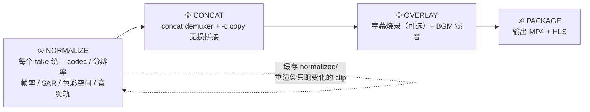
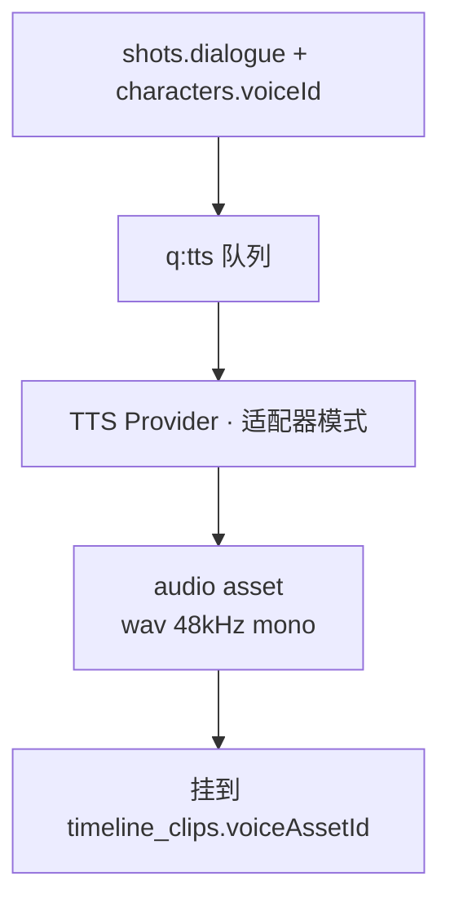

# 10 · 媒体存储、拼接与音频

> Status: Draft v1 · 2026-08-10 · 依赖：`02-data-model.md`、`09-python-worker.md` · 对应 ADR-0004

## 1. 存储：从第一天就当成 S3

本地用 MinIO 提供 S3 API。代码里**永远只有 S3 SDK**，没有 `fs.writeFile`。这样将来换云存储是改一个 endpoint 的事，而不是重写整个媒体层。

```yaml
# infra/docker-compose.yml 片段
minio:
  image: minio/minio:latest
  command: server /data --console-address ":9001"
  environment:
    MINIO_ROOT_USER: adminlocal
    MINIO_ROOT_PASSWORD: adminlocal123
  ports: ["9000:9000", "9001:9001"]
  volumes: ["./.data/minio:/data"]
```

### 1.1 Bucket 与 key 规范

单 bucket `drama`，靠 key 前缀分区（见 `02-data-model.md` §5）：

```
projects/{projectId}/refs/{characterId}/{assetId}.png
projects/{projectId}/takes/{shotId}/{jobId}.mp4
projects/{projectId}/audio/{shotId}/{takeId}-voice.wav
projects/{projectId}/renders/{episodeId}/v{n}/master.mp4
projects/{projectId}/renders/{episodeId}/v{n}/hls/index.m3u8
```

好处：按项目批量清理是一条 prefix 删除；按 shot 找产物不用查库。

### 1.2 三种访问模式

| 场景 | 方式 | TTL |
|---|---|---|
| 浏览器播放/预览 | 控制面 302 到预签名 GET URL | 15 min |
| Worker 上传产物 | 控制面签发预签名 PUT URL | 1 h |
| Provider 拉取参考图 | 预签名 GET URL | 1 h |

**控制面绝不代理媒体字节流。** 它只签 URL、只搬元数据。这条守住了，Mac 的带宽和内存就不会成为瓶颈。

### 1.3 内容寻址与去重

所有资产入库前算 sha256。相同 hash 直接复用已有 asset 行（新建引用而非新建对象）——参考图和重复生成的场景下能省不少空间。

```ts
const sha = await sha256Stream(stream)
const existing = await db.query.assets.findFirst({ where: eq(assets.sha256, sha) })
if (existing) return existing   // 复用
```

## 2. FFmpeg 拼接

由 `workers/media`（CPU，本机 docker）执行。

### 2.1 为什么不用 concat demuxer 直接拼

各镜头来自不同 provider，编码参数五花八门（不同 profile、不同 GOP、不同色彩空间）。`-c copy` 的无损拼接要求参数完全一致，实际做不到。

方案是**两段式**：先把每个 clip 规范化到统一参数，再无损拼接。



第 ① 步产物缓存到 `renders/{episodeId}/normalized/{takeId}.mp4`，重渲染时只重跑变化的 clip。这让「改一个镜头重渲染整集」从几分钟降到几秒。

### 2.2 规范化命令

```bash
ffmpeg -y -i "$IN" \
  -vf "scale=1080:1920:force_original_aspect_ratio=increase,\
crop=1080:1920,setsar=1,fps=24" \
  -c:v libx264 -preset veryfast -crf 20 -pix_fmt yuv420p \
  -profile:v high -level 4.1 -g 48 -keyint_min 48 -sc_threshold 0 \
  -c:a aac -b:a 128k -ar 48000 -ac 2 \
  -movflags +faststart \
  "$OUT"
```

关键点说明：

- `-g 48 -keyint_min 48 -sc_threshold 0`：固定 GOP = 2 秒，这是后续切 HLS 能对齐的前提。不固定的话切片会漂。
- `setsar=1`：统一像素宽高比，否则拼接后画面会被拉伸。
- **没有音频的 clip 必须补静音轨**，否则 concat 时音画会错位：
  ```bash
  -f lavfi -i anullsrc=channel_layout=stereo:sample_rate=48000 -shortest
  ```
- `-movflags +faststart`：moov box 前置，浏览器可边下边播。

### 2.3 拼接

```bash
# concat_list.txt
file 'normalized/take-a.mp4'
inpoint 0.0
outpoint 3.8
file 'normalized/take-b.mp4'
...

ffmpeg -y -f concat -safe 0 -i concat_list.txt -c copy master_raw.mp4
```

`inpoint/outpoint` 直接对应 `timeline_clips.trimStartSec/trimEndSec`。

### 2.4 转场

MVP 只支持硬切（`cut`）——硬切在短剧里本来就是主流，节奏快。溶解/淡入淡出需要重编码相邻片段，M4 之后再加：

```bash
# dissolve 示例（仅在需要时对相邻两 clip 单独处理）
ffmpeg -i a.mp4 -i b.mp4 -filter_complex \
  "[0][1]xfade=transition=fade:duration=0.4:offset=3.6[v]" -map "[v]" out.mp4
```

### 2.45 分级 conform：三层版本自动派生

L1/L0 **不重新渲染整集，只做镜头替换**。替换清单由分镜阶段产出（`03-pipeline.md` §S3）：

```jsonc
// episode_012.conform.json
{ "shot_047": { "L2": "take_a.mp4", "L1": "take_a_cover.mp4", "L0": "take_a_reaction.mp4" },
  "shot_048": { "L2": "take_b.mp4", "L1": null, "L0": null } }   // null = 该层直接删除此镜
```

conform 服务读清单 → 换 concat 列表 → 复用已 normalize 的中间件 → `-c copy` 拼接。**一个分级版本的渲染时间接近于零**，因为 normalize 是最贵的一步且已缓存（§2.1）。

三处分层控制点，按成本从低到高：

| 控制点 | 做法 | 成本 |
|---|---|---|
| **对白粗口** | 对白 stem 单独存储，换一行 TTS 台词即可 | **接近零**——这是 AI 短剧相对实拍最大的结构性优势，架构上必须兑现 |
| **暴力后果可见性** | 血迹/伤口/冲击瞬间做成独立合成层，整层可关 | 低 |
| **尺度镜头** | 替换为覆盖镜头或直接删除 | 低（前提是分镜阶段守住"剧情与尺度不同镜"） |

### 2.5 字幕

**烧录是渲染阶段的决策，不是制作阶段的决策。** 所有正片一律以 **clean 母版（不烧字幕）+ sidecar SRT/VTT** 存储，任何烧录版本都是从这两者派生的渲染产物。否则每加一个平台或语言就要重剪。

| 用途 | 字幕形态 |
|---|---|
| App / Web 正片 | **不烧录**，走 sidecar，可开关可换语言 |
| 投放与自然切条素材 | **必须烧录**——静音观看是常态。上三分之一、白色粗体高对比、≤8 词、避开平台 UI 安全区 |
| YouTube 长视频 | 不烧录，上传 SRT 作 CC（利于搜索） |

```bash
# 生成 VTT：直接用 shots.dialogue + clip 时间轴，不做 ASR
# 烧录：
ffmpeg -i master_raw.mp4 -vf "subtitles=sub.srt:force_style=\
'FontName=PingFang SC,FontSize=16,PrimaryColour=&H00FFFFFF,\
OutlineColour=&H80000000,BorderStyle=3,Outline=1,Shadow=0,MarginV=90'" \
  -c:a copy master_sub.mp4
```

`MarginV=90` 是竖屏适配——字幕要避开底部的播放控件与平台 UI 遮挡区。

### 2.6 音频混合

```bash
ffmpeg -i video.mp4 -i voice.wav -i bgm.mp3 -filter_complex \
  "[1:a]volume=1.0[v1];\
   [2:a]volume=0.22,afade=t=in:d=1,afade=t=out:st=88:d=2[v2];\
   [v1][v2]amix=inputs=2:duration=first:dropout_transition=0[a]" \
  -map 0:v -map "[a]" -c:v copy -c:a aac -b:a 192k out.mp4
```

BGM 压到 0.22 是经验值——短剧靠台词推进，音乐盖过人声是新手最常犯的错。进阶可用 `sidechaincompress` 做自动闪避（有人声时自动压低 BGM）：

```bash
[bgm][voice]sidechaincompress=threshold=0.05:ratio=8:attack=5:release=300[ducked]
```

## 3. HLS 打包

```bash
ffmpeg -i master.mp4 \
  -c copy -f hls \
  -hls_time 4 -hls_playlist_type vod \
  -hls_segment_filename "hls/seg_%03d.ts" \
  hls/index.m3u8
```

`-hls_time 4` 与 §2.2 的 2 秒 GOP 对齐（4 = 2×2），切片边界正好落在关键帧上。

MVP 单码率即可。多码率梯度（1080p/720p/480p）在需要模拟真实分发时再加，用 `-var_stream_map`。

## 4. 缩略图与预览

```bash
# 首帧缩略图（列表用）
ffmpeg -i take.mp4 -vf "select=eq(n\,0),scale=270:480" -vframes 1 thumb.jpg

# 悬停预览：3 秒静音低码率片段
ffmpeg -i take.mp4 -t 3 -an -vf "scale=270:480" -c:v libx264 -crf 32 -preset veryfast preview.mp4

# 雪碧图（时间线 scrubbing 用）
ffmpeg -i master.mp4 -vf "fps=1/2,scale=160:284,tile=10x10" sprite.jpg
```

缩略图与预览在 take 创建时**异步生成**，不阻塞主流程。分镜页几十个卡片同时加载原始 mp4 会把浏览器打爆——必须有轻量预览版本。

## 5. TTS 与配音

### 5.0 M&E 分层母版（多语言的前提）

每集必须输出**分离的音轨 stem**：对白 / 音乐 / 音效。理由有二：

1. **分级需要**：换一行粗口台词只需重合成对白 stem（见 §2.45）
2. **多语言需要**：拉美（西语/葡语）是北美之后的第一增量市场，没有 M&E 轨就要整集重做

配音优于字幕：同一内容母语观众看配音版的观看时长可达字幕版的数倍。这条对留存的影响远大于画面质量的边际提升。

### 5.1 流程



TTS 也用适配器抽象，与视频 provider 同构：

```ts
export interface TTSProvider {
  readonly id: string
  synthesize(req: {
    text: string; voiceId: string; speed?: number; emotion?: string
  }): Promise<{ storageKey: string; durationSec: number; costMicroUsd: number }>
  listVoices(): Promise<Voice[]>
}
```

候选：本地 CosyVoice / Chatterbox（无内容限制、零边际成本）、云端 ElevenLabs（R 级台词在其政策内可用，暴力条款明确豁免虚构语境）。开发期用本地。

**英语 R 级短剧的四条特殊要求**：

| 要求 | 说明 |
|---|---|
| 美式口音为默认，且需**口音多样性** | 南方口音标记蓝领、英式口音标记反派——北美观众对此高度敏感，是塑造角色的低成本手段 |
| **粗口不能被软化或吞掉** | "frequent profanity" 是 R 级的分级特征之一，需要专门的发音词典与情绪标记 |
| **口型同步是 R 级硬指标** | R 级依赖表演张力（愤怒、威胁、亲密），口型不同步会直接摧毁这些镜头。这与动态漫路线可以省掉口型的判断相反 |
| per-character 音色跨集锁定 | 与 `characters.voiceId` 绑定，80–100 集不能漂 |

### 5.2 时长对齐

TTS 输出时长常与镜头时长不匹配。三种处理，按优先级：

1. **调整镜头时长**（首选）：`timeline_clips.trimEndSec` 顺延，让画面等台词。短剧节奏容忍这个。
2. **微调语速**（±10% 以内）：`atempo=1.08`，超过 10% 人耳能听出不自然。
3. **重写台词**：太长就改短。这是最根本的解法，UI 上应提示「本镜台词预计 6.2s，镜头仅 4.0s」。

第 3 点要在 S3 分镜阶段就做校验，而不是等到 S6 才发现——`06-api-spec.md` 的 `shotlist` 端点应当估算台词时长（英语按 2.8 词/秒（中文 4.5 字/秒））并回填。

## 6. 存储生命周期

| 类别 | 保留策略 |
|---|---|
| 参考图、LoRA、母版 | **永久**，绝不自动删 |
| selected takes | 永久 |
| rejected/archived takes | 30 天后可清理（UI 提供批量清理，不自动执行） |
| normalized 中间文件 | 7 天，可随时重建 |
| 缩略图/预览 | 可随时重建，跟随源文件 |

**永不自动删除已经花钱生成的东西**——与 `03-pipeline.md` §7 同一条原则。清理必须是人主动触发的显式动作，且要显示将释放多少空间、影响哪些资产。

## 7. 容量估算

单集 60 镜、每镜 4 秒 720p：

| 项 | 单个 | 单集合计 |
|---|---|---|
| 原始 take（含 2.5 次平均尝试） | ~3 MB | ~450 MB |
| normalized 中间件 | ~4 MB | ~240 MB |
| 配音 wav | ~400 KB | ~24 MB |
| 母版 1080p | — | ~90 MB |
| HLS 切片 | — | ~90 MB |
| 缩略图/预览 | ~200 KB | ~12 MB |
| **合计** | | **~900 MB/集** |

一部 60 集的剧约 **55 GB**。Mac 本地盘要预留，或把 MinIO 的数据卷挂到外置 SSD。这个数字值得在项目开始前就知道——它决定了你是否需要立刻上外置存储。
